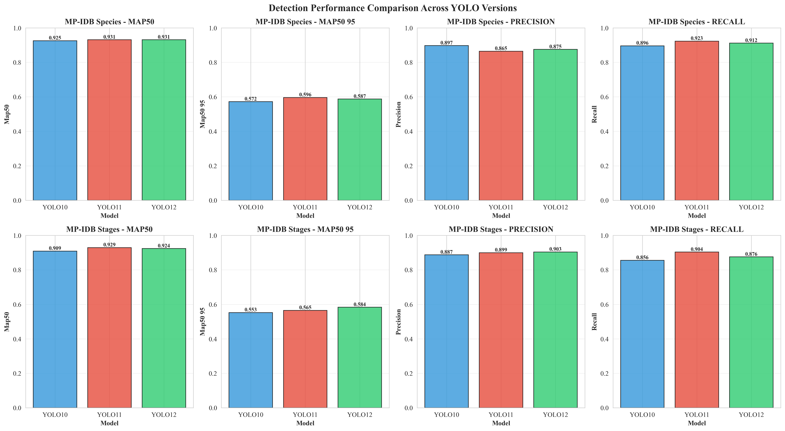

# 📊 FIGURES UNTUK MARKDOWN DOCUMENTS

**Updated**: October 8, 2025
**Dataset**: MP-IDB Species + MP-IDB Stages ONLY

---

## 📋 RINGKASAN

Berikut daftar **10 main figures** yang harus dimasukkan ke dalam dokumen Markdown (Laporan Kemajuan & JICEST Paper), berdasarkan file yang tersedia di `luaran/figures/`.

---

## 🎨 MAIN FIGURES (10 Files)

### **Figure 1: Pipeline Architecture (Option A)**
```markdown
**Figure 1. Option A Shared Classification Architecture**
- **Path**: `luaran/figures/pipeline_architecture.png` (280 KB)
- **Deskripsi**: Diagram alur lengkap sistem deteksi + klasifikasi dengan arsitektur Option A
- **Konten**: Detection (YOLO) → Ground Truth Crops → Shared Classification (CNN)
- **Penempatan**: Section 2 (Materials & Methods) - Architecture Overview
```

### **Figure 2: Detection Performance Comparison**
```markdown
**Figure 2. YOLO Detection Performance Across Datasets**
- **Path**: `luaran/figures/detection_performance_comparison.png` (339 KB)
- **Deskripsi**: Perbandingan mAP@50, mAP@50-95, precision, recall untuk 3 model YOLO
- **Konten**: Bar chart untuk MP-IDB Species + MP-IDB Stages
- **Penempatan**: Section 3.1 (Results - Detection Performance)
```

### **Figure 3: Classification Accuracy Heatmap**
```markdown
**Figure 3. Classification Model Performance Heatmap**
- **Path**: `luaran/figures/classification_accuracy_heatmap.png` (260 KB)
- **Deskripsi**: Heatmap akurasi untuk 6 CNN architectures × 2 datasets
- **Konten**: Color-coded performance (darker = better)
- **Rows**: DenseNet121, EfficientNet-B0/B1/B2, ResNet50/101
- **Columns**: MP-IDB Species, MP-IDB Stages
- **Penempatan**: Section 3.2 (Results - Classification Performance)
```

### **Figure 4: Training Curves (Multi-Model)**
```markdown
**Figure 4. Classification Training Progress**
- **Path**: `luaran/figures/training_curves.png` (614 KB)
- **Deskripsi**: Loss dan accuracy curves selama 75 epochs training
- **Konten**: Training vs validation curves untuk best models
- **Penempatan**: Section 3.2 (Results - Classification Performance)
```

### **Figure 5: Confusion Matrices (Combined)**
```markdown
**Figure 5. Classification Confusion Matrices**
- **Path**: `luaran/figures/confusion_matrices.png` (224 KB)
- **Deskripsi**: Confusion matrices untuk best classification models
- **Konten**:
  - MP-IDB Species (EfficientNet-B1, 98.8% accuracy)
  - MP-IDB Stages (EfficientNet-B0, 94.31% accuracy)
- **Penempatan**: Section 3.2 (Results - Classification Performance)
```

### **Figure 6: Species F1-Score Comparison**
```markdown
**Figure 6. Per-Class F1-Scores for Species Classification**
- **Path**: `luaran/figures/species_f1_comparison.png` (153 KB)
- **Deskripsi**: F1-score per species untuk 6 CNN models
- **Konten**:
  - P. falciparum (227 samples)
  - P. malariae (18 samples)
  - P. ovale (5 samples)
  - P. vivax (18 samples)
- **Penempatan**: Section 3.2 (Results - Per-Class Analysis)
```

### **Figure 7: Stages F1-Score Comparison**
```markdown
**Figure 7. Per-Class F1-Scores for Lifecycle Stage Classification**
- **Path**: `luaran/figures/stages_f1_comparison.png` (142 KB)
- **Deskripsi**: F1-score per lifecycle stage untuk 6 CNN models
- **Konten**:
  - Ring (272 samples)
  - Trophozoite (15 samples)
  - Schizont (7 samples)
  - Gametocyte (5 samples)
- **Highlight**: Severe class imbalance challenge
- **Penempatan**: Section 3.2 (Results - Per-Class Analysis)
```

### **Figure 8: Class Imbalance Distribution**
```markdown
**Figure 8. Test Set Class Distribution**
- **Path**: `luaran/figures/class_imbalance_distribution.png` (270 KB)
- **Deskripsi**: Pie charts menunjukkan severe class imbalance
- **Konten**:
  - MP-IDB Species distribution
  - MP-IDB Stages distribution (extreme: 272 ring vs 5 gametocyte)
- **Penempatan**: Section 4 (Discussion - Class Imbalance Challenge)
```

### **Figure 9: Model Efficiency Analysis**
```markdown
**Figure 9. Model Parameters vs Classification Accuracy**
- **Path**: `luaran/figures/model_efficiency_analysis.png` (291 KB)
- **Deskripsi**: Scatter plot menunjukkan smaller models outperform larger ones
- **Konten**:
  - X-axis: Model parameters (5.3M - 44.5M)
  - Y-axis: Accuracy (%)
  - Highlight: EfficientNet (5-8M params) > ResNet101 (44.5M params)
- **Penempatan**: Section 4 (Discussion - Model Efficiency)
```

### **Figure 10: Precision-Recall Tradeoff**
```markdown
**Figure 10. Precision-Recall Analysis per Class**
- **Path**: `luaran/figures/precision_recall_tradeoff.png` (239 KB)
- **Deskripsi**: Tradeoff analysis untuk majority vs minority classes
- **Konten**: Precision-recall curves untuk all classes
- **Highlight**: High recall (100%) pada P. ovale despite 5 samples
- **Penempatan**: Section 4 (Discussion - Clinical Deployment)
```

---

## 📚 SUPPLEMENTARY FIGURES (15 Files)

Disimpan di: `luaran/figures/supplementary/`

### **Detection-Related (6 files)**
1. **detection_ground_truth_examples_species.jpg** (573 KB)
   - Ground truth bounding boxes untuk MP-IDB Species

2. **detection_ground_truth_examples_stages.jpg** (573 KB)
   - Ground truth bounding boxes untuk MP-IDB Stages

3. **detection_predictions_examples_species.jpg** (629 KB)
   - YOLO predictions vs ground truth (Species)

4. **detection_predictions_examples_stages.jpg** (649 KB)
   - YOLO predictions vs ground truth (Stages)

5. **detection_PR_curve_species_yolo11.png** (87 KB)
   - Precision-Recall curve untuk YOLO11 (Species)

6. **detection_F1_curve_species_yolo11.png** (106 KB)
   - F1-score confidence curve (Species)

### **Training Curves (3 files)**
7. **training_curves_species_efficientnet_b1.png** (99 KB)
   - Detailed training curves (Species, best model)

8. **training_curves_stages_efficientnet_b0.png** (96 KB)
   - Detailed training curves (Stages, best model)

9. **detection_training_results_species_yolo11.png** (243 KB)
   - YOLO11 training metrics (Species)

### **Confusion Matrices (2 files)**
10. **confusion_matrix_species_efficientnet_b1.png** (27 KB)
    - Standalone confusion matrix (Species)

11. **confusion_matrix_stages_efficientnet_b0.png** (29 KB)
    - Standalone confusion matrix (Stages)

### **Data Augmentation (3 files)**
12. **data_augmentation_examples.png** (758 KB)
    - Before/after augmentation examples

13. **augmentation_training_14x.png** (2.1 MB)
    - 14× augmentation visualization (training set)

14. **augmentation_validation_7x.png** (1.4 MB)
    - 7× augmentation visualization (validation set)

### **Grad-CAM Visualizations (6 files)**
15. **gradcam_explanation.png** (1.1 MB)
    - Grad-CAM methodology explanation

16. **gradcam_composite_species.png** (1.5 MB)
    - Grad-CAM heatmaps untuk best species classification

17. **gradcam_composite_stages.png** (1.1 MB)
    - Grad-CAM heatmaps untuk best stages classification

18. **gradcam_full_images_species.png** (24 MB)
    - Full resolution Grad-CAM grid (Species)

19. **gradcam_full_images_stages.png** (28 MB)
    - Full resolution Grad-CAM grid (Stages)

20. **gradcam_species/** (folder)
    - Individual Grad-CAM images (Species)

21. **gradcam_stages/** (folder)
    - Individual Grad-CAM images (Stages)

---

## 📝 FORMAT PENULISAN DI MARKDOWN

### **Untuk Main Figures (di body text):**

```markdown
### 2.3 Proposed Architecture

Our proposed Option A architecture employs a shared classification approach, as illustrated in **Figure 1**.

**Figure 1. Option A Shared Classification Architecture**


*Figure 1 shows the complete pipeline: YOLO detection generates bounding boxes, ground truth crops are created from annotations, and a single classification model is trained once and reused across all detection methods.*

---

### 3.1 Detection Performance

Detection results across MP-IDB datasets are presented in **Figure 2**.

**Figure 2. YOLO Detection Performance Across Datasets**



*Figure 2 demonstrates competitive performance across all three YOLO variants (v10, v11, v12) on both MP-IDB Species and Stages datasets, with mAP@50 ranging from 90.91% to 93.12%.*
```

### **Untuk Supplementary Figures (di appendix):**

```markdown
## APPENDIX A: SUPPLEMENTARY FIGURES

### S1. Ground Truth Detection Examples

**Figure S1. Ground Truth Bounding Boxes - MP-IDB Species**


*Expert-annotated bounding boxes showing location and extent of malaria parasites in blood smears.*

---

### S2. Grad-CAM Visualization

**Figure S2. Grad-CAM Attention Maps - Species Classification**


*Gradient-weighted Class Activation Mapping (Grad-CAM) visualizations highlighting regions of interest for EfficientNet-B1 model decisions.*
```

---

## 🎯 REKOMENDASI PENEMPATAN

### **Laporan Kemajuan (Lengkap)**
Gunakan **SEMUA 10 main figures + SEMUA 15 supplementary figures**
- Main figures: Di bagian hasil dan pembahasan
- Supplementary: Di appendix

### **JICEST Paper (Selektif)**
Gunakan **6-8 main figures** (batasan halaman jurnal)
- **WAJIB (6):**
  1. Pipeline Architecture (Figure 1)
  2. Detection Performance (Figure 2)
  3. Classification Heatmap (Figure 3)
  4. Confusion Matrices (Figure 5)
  5. Species F1-Score (Figure 6)
  6. Stages F1-Score (Figure 7)

- **OPSIONAL (2-4):**
  7. Training Curves (Figure 4) - jika ada space
  8. Model Efficiency (Figure 9) - untuk discussion
  9. Class Imbalance (Figure 8) - untuk challenges
  10. Precision-Recall (Figure 10) - untuk clinical relevance

- **Supplementary**: Referensi saja, upload terpisah ke jurnal

---

## ✅ CHECKLIST FIGURE INSERTION

### Untuk JICEST Paper:
- [ ] Figure 1: Pipeline Architecture
- [ ] Figure 2: Detection Performance
- [ ] Figure 3: Classification Heatmap
- [ ] Figure 4: Training Curves
- [ ] Figure 5: Confusion Matrices
- [ ] Figure 6: Species F1-Score
- [ ] Figure 7: Stages F1-Score
- [ ] Figure 8: Class Imbalance

### Untuk Laporan Kemajuan:
- [ ] Semua 10 main figures
- [ ] Semua 15 supplementary figures (appendix)
- [ ] Caption Indonesia + penjelasan lengkap

---

## 📊 SUMMARY

| Document | Main Figures | Supplementary | Total |
|----------|-------------|---------------|-------|
| **JICEST Paper** | 6-8 (selektif) | References only | 6-8 |
| **Laporan Kemajuan** | 10 (semua) | 15 (appendix) | 25 |

---

**Note**: Semua path figures menggunakan relative path `figures/` atau `figures/supplementary/` agar portable ketika generate DOCX.

**Generated**: October 8, 2025
**Dataset**: MP-IDB Species + MP-IDB Stages (418 images, 8 classes)
