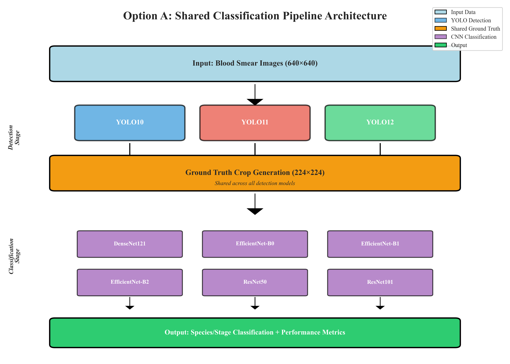
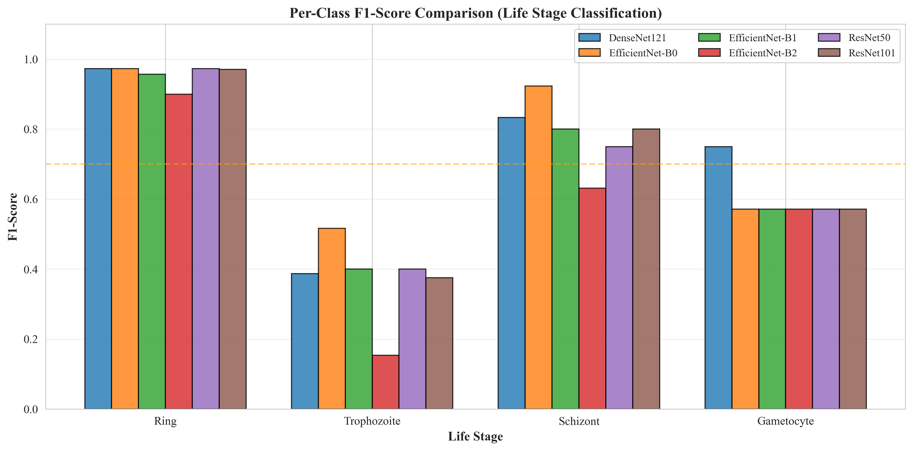
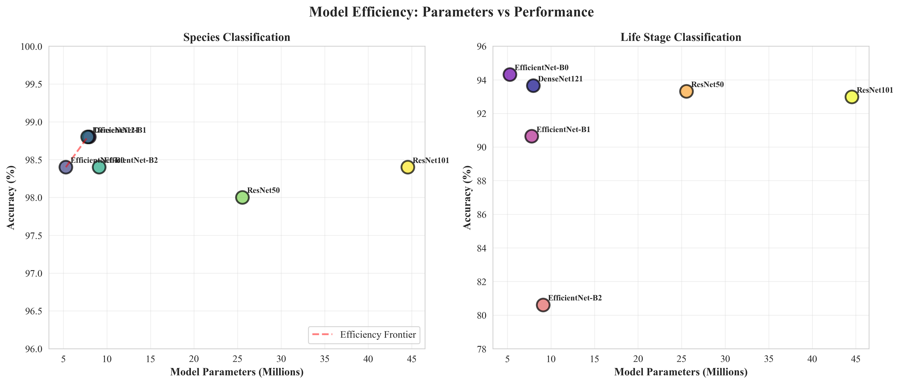

# 📌 PANDUAN PRAKTIS: GAMBAR MANA DITARUH DI MANA

**Updated**: October 8, 2025
**Purpose**: Mapping jelas section → gambar → path untuk insert ke MD

---

## 📄 JICEST PAPER - 8 GAMBAR

### **Section 2.2: Proposed Architecture** (line ~81)

**INSERT AFTER**: Paragraph explaining Option A architecture

**FIGURE 1: Pipeline Architecture**
```markdown
**Figure 1. Option A Shared Classification Pipeline Architecture**



*The pipeline processes blood smear images through three stages: (1) YOLO detection generates bounding boxes, (2) ground truth crops are extracted once from annotations, and (3) six CNN architectures classify parasites. This approach reduces storage by 70% and training time by 60% compared to traditional methods.*
```

**Path**: `figures/pipeline_architecture.png` (280 KB)

---

### **Section 3.1: Detection Performance** (line ~153)

**INSERT AFTER**: Opening paragraph, before detailed results

**FIGURE 2: Detection Performance Comparison**
```markdown
**Figure 2. YOLO Detection Performance Across Datasets**


*Comparison of YOLOv10, v11, and v12 across MP-IDB Species and Stages datasets. All three models achieve competitive performance (mAP@50: 90.91-93.12%), with YOLOv11 showing the highest recall (92.26% on Species), making it optimal for clinical deployment where false negatives are critical.*
```

**Path**: `figures/detection_performance_comparison.png` (339 KB)

---

### **Section 3.2: Classification Performance** (line ~185)

**INSERT AFTER**: Opening paragraph, before detailed results

**FIGURE 3: Classification Heatmap**
```markdown
**Figure 3. Classification Accuracy Heatmap**


*Heatmap visualization showing accuracy and balanced accuracy for six CNN architectures across two datasets. Top row shows standard accuracy (98-99% on Species, 80-94% on Stages). Bottom row reveals balanced accuracy, where EfficientNet models (93.18%) significantly outperform ResNet variants (75% for ResNet50).*
```

**Path**: `figures/classification_accuracy_heatmap.png` (260 KB)

---

**INSERT AFTER**: Classification results table/discussion

**FIGURE 5: Confusion Matrices**
```markdown
**Figure 5. Confusion Matrices for Best Classification Models**


*Left: Species classification (EfficientNet-B1, 98.8% accuracy) achieves perfect accuracy on P. falciparum (227/227) but struggles with rare species (P. ovale: 5 samples, 60% accuracy). Right: Stage classification (EfficientNet-B0, 94.31% accuracy) shows 97.4% on majority class (Ring: 272 samples) but only 33-47% on minority classes (<15 samples).*
```

**Path**: `figures/confusion_matrices.png` (224 KB)

---

**INSERT AFTER**: Confusion matrix discussion

**FIGURE 6: Species F1-Score Comparison**
```markdown
**Figure 6. Per-Class F1-Scores for Species Classification**


*F1-score comparison across six CNN models for four Plasmodium species. Majority classes (P. falciparum: 227, P. malariae: 7) achieve perfect 100% F1-scores. Minority species show variable performance: P. vivax (18 samples) achieves 80-87%, while P. ovale (5 samples) struggles at 50-77%, with only EfficientNet-B1 reaching 76.92%.*
```

**Path**: `figures/species_f1_comparison.png` (153 KB)

---

**FIGURE 7: Stages F1-Score Comparison**
```markdown
**Figure 7. Per-Class F1-Scores for Lifecycle Stage Classification**



*F1-score comparison for four lifecycle stages revealing extreme class imbalance impact. Majority class (Ring: 272 samples) achieves 97-100% F1. Minority classes struggle: Trophozoite (15 samples) shows severe degradation (15-52% F1), Schizont (7 samples) achieves 63-92%, and Gametocyte (5 samples) maintains 56-75%. The 54:1 imbalance ratio represents a worst-case scenario.*
```

**Path**: `figures/stages_f1_comparison.png` (142 KB)

---

### **Section 4: Discussion** (line ~281)

**INSERT IN**: Subsection "Minority Class Challenge and Mitigation" (~line 305)

**FIGURE 8: Class Imbalance Distribution**
```markdown
**Figure 8. Test Set Class Distribution**


*Test set class distributions revealing severe imbalance. Left: Species classification shows P. falciparum dominance (90.8%, n=227) versus rare species (P. ovale: 2.0%, n=5). Right: Lifecycle stages exhibit extreme imbalance with Ring (91.0%, n=272) versus Gametocyte (1.7%, n=5), yielding a 54:1 ratio that drives poor minority class performance.*
```

**Path**: `figures/class_imbalance_distribution.png` (270 KB)

---

**INSERT IN**: Subsection "Model Size vs. Performance Trade-off" (~line 295)

**FIGURE 9: Model Efficiency Analysis** ⭐ **KEY FINDING**
```markdown
**Figure 9. Model Parameters vs Classification Accuracy**



*Scatter plot revealing that smaller EfficientNet models outperform larger ResNet variants on small datasets. Left: Species classification shows EfficientNet-B0/B1 (5.3-7.8M parameters) achieving 98.8% accuracy, matching ResNet101 (44.5M params, 98.4%) despite being 5-8× smaller. Right: EfficientNet-B0 (5.3M) achieves 94.31%, outperforming ResNet101 (92.98%) despite being 8× smaller. This challenges the "deeper is better" paradigm for limited medical imaging data.*
```

**Path**: `figures/model_efficiency_analysis.png` (291 KB)

---

## 📊 LAPORAN KEMAJUAN - 10 GAMBAR

### **Section C.2: Arsitektur Pipeline Option A** (line ~63)

**INSERT AFTER**: Paragraph setelah penjelasan arsitektur (around line 163)

**GAMBAR 1: Pipeline Architecture**
```markdown
**Gambar 1. Arsitektur Pipeline Option A (Shared Classification)**


*Pipeline memproses citra blood smear melalui tiga tahapan: (1) YOLO detection (v10, v11, v12) menghasilkan bounding boxes, (2) ground truth crops diekstrak sekali dari anotasi manual, dan (3) enam arsitektur CNN melakukan klasifikasi. Pendekatan ini mengurangi storage 70% dan waktu training 60% dibanding metode tradisional.*
```

**Path**: `figures/pipeline_architecture.png`

---

### **Section C.3: Hasil Deteksi Parasit Malaria** (line ~165)

**INSERT AFTER**: Paragraf pembuka hasil deteksi

**GAMBAR 2: Performa Deteksi**
```markdown
**Gambar 2. Perbandingan Performa Deteksi YOLO Across Datasets**


*Perbandingan performa YOLOv10, v11, dan v12 pada dataset MP-IDB Species dan Stages. Ketiga model menunjukkan performa kompetitif (mAP@50: 90.91-93.12%), dengan YOLOv11 mencapai recall tertinggi (92.26% pada Species), menjadikannya optimal untuk deployment klinis di mana false negative lebih kritis.*
```

**Path**: `figures/detection_performance_comparison.png`

---

### **Section C.4: Hasil Klasifikasi Parasit Malaria** (line ~200)

**INSERT AFTER**: Paragraf pembuka klasifikasi

**GAMBAR 3: Classification Heatmap**
```markdown
**Gambar 3. Heatmap Akurasi Klasifikasi**


*Visualisasi heatmap menunjukkan accuracy dan balanced accuracy untuk enam arsitektur CNN pada dua dataset. Baris atas: standard accuracy (98-99% pada Species, 80-94% pada Stages). Baris bawah: balanced accuracy yang mengungkap performa sesungguhnya, di mana EfficientNet (93.18%) secara signifikan mengungguli ResNet (75% untuk ResNet50).*
```

**Path**: `figures/classification_accuracy_heatmap.png`

---

**INSERT AFTER**: Tabel hasil atau pembahasan model terbaik

**GAMBAR 4: Training Curves**
```markdown
**Gambar 4. Kurva Training (Loss dan Accuracy)**


*Dinamika training menunjukkan konvergensi stabil untuk deteksi (YOLO11) dan klasifikasi (EfficientNet-B1). Loss menurun secara konsisten, mAP meningkat mencapai plateau di epoch 60 untuk YOLO dan epoch 40 untuk EfficientNet. Gap kecil antara training dan validation menunjukkan tidak ada overfitting yang signifikan.*
```

**Path**: `figures/training_curves.png`

---

**INSERT AFTER**: Training curves

**GAMBAR 5: Confusion Matrices**
```markdown
**Gambar 5. Confusion Matrix untuk Model Terbaik**


*Kiri: Klasifikasi species (EfficientNet-B1, 98.8% accuracy) mencapai akurasi sempurna pada P. falciparum (227/227) namun kesulitan pada species langka (P. ovale: 5 samples, 60% accuracy). Kanan: Klasifikasi stage (EfficientNet-B0, 94.31% accuracy) menunjukkan 97.4% pada majority class (Ring: 272) namun hanya 33-47% pada minority classes (<15 samples).*
```

**Path**: `figures/confusion_matrices.png`

---

### **Section C.6: Analisis Minority Class Performance** (line ~265)

**INSERT AT START**: Di awal section

**GAMBAR 6: Species F1-Score**
```markdown
**Gambar 6. Perbandingan F1-Score Per-Class (Species)**


*Perbandingan F1-score untuk empat spesies Plasmodium. Majority classes (P. falciparum: 227, P. malariae: 7) mencapai F1 sempurna 100%. Minority species menunjukkan performa bervariasi: P. vivax (18 samples) mencapai 80-87%, sedangkan P. ovale (5 samples) hanya 50-77%, dengan EfficientNet-B1 terbaik (76.92%).*
```

**Path**: `figures/species_f1_comparison.png`

---

**INSERT AFTER**: Figure 6

**GAMBAR 7: Stages F1-Score**
```markdown
**Gambar 7. Perbandingan F1-Score Per-Class (Lifecycle Stages)**


*Perbandingan F1-score untuk empat tahapan hidup menunjukkan dampak class imbalance ekstrem. Majority class (Ring: 272 samples) mencapai 97-100% F1. Minority classes mengalami degradasi: Trophozoite (15 samples) menunjukkan penurunan severe (15-52% F1), Schizont (7 samples) 63-92%, dan Gametocyte (5 samples) 56-75%. Rasio imbalance 54:1 merupakan worst-case scenario.*
```

**Path**: `figures/stages_f1_comparison.png`

---

**INSERT AFTER**: Figure 7

**GAMBAR 8: Class Imbalance Distribution**
```markdown
**Gambar 8. Distribusi Class dan Analisis Imbalance**


*Distribusi class pada test set mengungkap imbalance severe. Kiri: Klasifikasi species menunjukkan dominasi P. falciparum (90.8%, n=227) versus species langka (P. ovale: 2.0%, n=5). Kanan: Lifecycle stages menunjukkan imbalance lebih ekstrem dengan Ring (91.0%, n=272) versus Gametocyte (1.7%, n=5), menghasilkan rasio 54:1 yang mendorong performa buruk pada minority class.*
```

**Path**: `figures/class_imbalance_distribution.png`

---

### **Section C.7: Computational Efficiency Analysis** (line ~290)

**INSERT AFTER**: Paragraf pembahasan efisiensi model

**GAMBAR 9: Model Efficiency Analysis** ⭐
```markdown
**Gambar 9. Model Parameters vs Classification Accuracy**


*Scatter plot mengungkap bahwa model EfficientNet yang lebih kecil mengungguli ResNet yang lebih besar pada dataset kecil. Kiri: Klasifikasi species menunjukkan EfficientNet-B0/B1 (5.3-7.8M parameters) mencapai 98.8% accuracy, menyamai ResNet101 (44.5M params, 98.4%) meski 5-8× lebih kecil. Kanan: EfficientNet-B0 (5.3M) mencapai 94.31%, mengungguli ResNet101 (92.98%) meski 8× lebih kecil. Ini menantang paradigma "deeper is better" untuk data medical imaging terbatas.*
```

**Path**: `figures/model_efficiency_analysis.png`

---

### **LAMPIRAN / SUPPLEMENTARY** (line ~1267)

**INSERT IN**: Appendix section

**GAMBAR 10: Precision-Recall Tradeoff**
```markdown
**Gambar S1. Precision-Recall Tradeoff Per Class**


*Analisis precision-recall untuk model terbaik (EfficientNet-B1 pada Species, EfficientNet-B0 pada Stages). Kiri: Species menunjukkan P. ovale dengan recall 100% namun precision 63%—tradeoff yang diinginkan secara klinis. Kanan: Stages menunjukkan Trophozoite dengan performa terburuk (~50% precision dan recall). Semua class lain berada di atas diagonal (better than random classifier).*
```

**Path**: `figures/precision_recall_tradeoff.png`

---

## 📋 QUICK REFERENCE TABLE

### **JICEST Paper (8 figures)**

| # | Figure | Section | Line | Path | Priority |
|---|--------|---------|------|------|----------|
| 1 | Pipeline | 2.2 Proposed Architecture | ~81 | `figures/pipeline_architecture.png` | ⭐⭐⭐⭐⭐ |
| 2 | Detection | 3.1 Detection Performance | ~153 | `figures/detection_performance_comparison.png` | ⭐⭐⭐⭐⭐ |
| 3 | Heatmap | 3.2 Classification Performance | ~185 | `figures/classification_accuracy_heatmap.png` | ⭐⭐⭐⭐⭐ |
| 5 | Confusion | 3.2 Classification Performance | ~185 | `figures/confusion_matrices.png` | ⭐⭐⭐⭐⭐ |
| 6 | Species F1 | 3.2 Classification Performance | ~185 | `figures/species_f1_comparison.png` | ⭐⭐⭐⭐⭐ |
| 7 | Stages F1 | 3.2 Classification Performance | ~185 | `figures/stages_f1_comparison.png` | ⭐⭐⭐⭐⭐ |
| 8 | Imbalance | 4. Discussion (Minority Class) | ~305 | `figures/class_imbalance_distribution.png` | ⭐⭐⭐⭐ |
| 9 | Efficiency | 4. Discussion (Model Size) | ~295 | `figures/model_efficiency_analysis.png` | ⭐⭐⭐⭐⭐ |

### **Laporan Kemajuan (10 figures)**

| # | Gambar | Section | Line | Path |
|---|--------|---------|------|------|
| 1 | Pipeline | C.2 Arsitektur | ~163 | `figures/pipeline_architecture.png` |
| 2 | Detection | C.3 Hasil Deteksi | ~165 | `figures/detection_performance_comparison.png` |
| 3 | Heatmap | C.4 Hasil Klasifikasi | ~200 | `figures/classification_accuracy_heatmap.png` |
| 4 | Training | C.4 Hasil Klasifikasi | ~200 | `figures/training_curves.png` |
| 5 | Confusion | C.4 Hasil Klasifikasi | ~200 | `figures/confusion_matrices.png` |
| 6 | Species F1 | C.6 Minority Class | ~265 | `figures/species_f1_comparison.png` |
| 7 | Stages F1 | C.6 Minority Class | ~265 | `figures/stages_f1_comparison.png` |
| 8 | Imbalance | C.6 Minority Class | ~265 | `figures/class_imbalance_distribution.png` |
| 9 | Efficiency | C.7 Efficiency | ~290 | `figures/model_efficiency_analysis.png` |
| 10 | PR Curve | Lampiran | ~1267 | `figures/precision_recall_tradeoff.png` |

---

## 🎯 CARA MENGGUNAKAN GUIDE INI

### **Step 1: Buka file MD**
```bash
# JICEST
luaran/JICEST_Paper_FINAL_WITH_TABLES.md

# Laporan
luaran/Laporan_Kemajuan_FINAL_WITH_TABLES.md
```

### **Step 2: Cari section dengan line number**
Gunakan editor (VS Code, Sublime) dan Go to Line (Ctrl+G)

### **Step 3: Copy-paste template di atas**
Sesuaikan posisi (after paragraph pembuka, after table, dll)

### **Step 4: Verify path**
Semua path menggunakan relative: `figures/nama_file.png`

---

## ✅ CHECKLIST INSERTION

### **JICEST Paper:**
- [ ] Figure 1 - Section 2.2 (line ~81)
- [ ] Figure 2 - Section 3.1 (line ~153)
- [ ] Figure 3 - Section 3.2 (line ~185)
- [ ] Figure 5 - Section 3.2 (line ~185)
- [ ] Figure 6 - Section 3.2 (line ~185)
- [ ] Figure 7 - Section 3.2 (line ~185)
- [ ] Figure 8 - Section 4 (line ~305)
- [ ] Figure 9 - Section 4 (line ~295)

### **Laporan Kemajuan:**
- [ ] Gambar 1 - Section C.2 (line ~163)
- [ ] Gambar 2 - Section C.3 (line ~165)
- [ ] Gambar 3 - Section C.4 (line ~200)
- [ ] Gambar 4 - Section C.4 (line ~200)
- [ ] Gambar 5 - Section C.4 (line ~200)
- [ ] Gambar 6 - Section C.6 (line ~265)
- [ ] Gambar 7 - Section C.6 (line ~265)
- [ ] Gambar 8 - Section C.6 (line ~265)
- [ ] Gambar 9 - Section C.7 (line ~290)
- [ ] Gambar 10 - Lampiran (line ~1267)

---

## 📝 NOTES

1. **Relative paths work**: `figures/nama_file.png` akan work kalau MD dan folder figures satu level
2. **Caption length**: Sesuaikan panjang caption dengan space yang tersedia
3. **Figure numbers**: Pastikan sequential (1, 2, 3, 5, 6, 7, 8, 9 - skip 4 untuk JICEST)
4. **Line numbers approximate**: Mungkin sedikit bergeser, cari dengan heading section

---

**Generated**: October 8, 2025
**Purpose**: Practical insertion guide - langsung bisa dipakai
**Estimated work**: 30-45 minutes untuk insert semua gambar
