# LAPORAN AKHIR PENELITIAN

## KERANGKA KERJA MULTI-MODEL HIBRIDA UNTUK DETEKSI DAN KLASIFIKASI MALARIA OTOMATIS

---

**Peneliti Utama**: [Nama Peneliti]
**Institusi**: [Nama Institusi]
**Skema Penelitian**: BISMA (Bantuan Inovasi Sains, Manajemen, dan Aplikasi)
**Periode Pelaksanaan**: Januari 2025 - Desember 2025 (12 bulan)
**Tanggal Laporan**: Desember 2025
**Sumber Data Eksperimen**: optA_20251207_233941

---

## C. HASIL PELAKSANAAN PENELITIAN

Penelitian berhasil memvalidasi sistem deteksi dan klasifikasi parasit malaria otomatis pada empat dataset publik (IML Lifecycle, MP-IDB Species, MP-IDB Stages, MD-2019 Stages) dengan total 1.544 citra apusan darah. Sistem menggunakan arsitektur hibrida: deteksi YOLO (YOLOv10/11/12) dan klasifikasi CNN (DenseNet121, EfficientNet B0/B1/B2, ResNet50/101) dengan Focal Loss untuk menangani ketidakseimbangan kelas ekstrem. Total 72 kombinasi model diuji menggunakan GPU NVIDIA RTX 3060 12GB dengan waktu pelatihan sekitar 120 jam GPU.

### C.1 Hasil Deteksi Parasit Malaria

**Tabel 2: Performa Deteksi YOLO pada 4 Dataset**

Lihat: `luaran\laporan_akhir\tables\Table2_Detection_Performance.xlsx`

Tabel menampilkan hasil evaluasi komprehensif tiga model deteksi YOLO (YOLOv10, YOLOv11, YOLOv12) pada keempat dataset dengan metrik standar object detection. Pada dataset IML Lifecycle, YOLOv11 mencapai mAP@50 tertinggi 96,61% dengan recall optimal 95,88%, mengindikasikan kemampuan deteksi parasit maksimal namun dengan trade-off presisi sedikit lebih rendah 86,17%. YOLOv12 memberikan trade-off seimbang dengan mAP@50: 96,16%, presisi 89,38%, dan mAP@50-95: 78,01% yang terbaik, mendemonstrasikan lokalisasi bounding box lebih presisi. Pada dataset MP-IDB Species, YOLOv11 kembali superior dengan mAP@50: 96,56% dan recall 95,29%, sementara YOLOv12 mencapai presisi tertinggi 94,38%. Pada dataset MP-IDB Stages yang paling menantang (ketidakseimbangan ekstrem), YOLOv12 unggul signifikan dengan mAP@50: 95,62% dan presisi 92,16%, mengindikasikan handling kelas minoritas lebih baik. Pada dataset MD-2019 Stages (terbesar, multi-patient), YOLOv12 mencapai mAP@50: 93,46% dan mAP@50-95 tertinggi 77,54%, menunjukkan robustness superior pada variasi morfologi tinggi. Kolom "Best Epoch" menunjukkan variasi konvergensi model: dataset sederhana (IML) konvergen cepat (epoch 18-47), sementara dataset kompleks (MP-IDB Stages, Species) memerlukan training lebih panjang (epoch 67-96).

**Gambar 1: Contoh Hasil Deteksi YOLO11 pada Dataset MP-IDB Species**

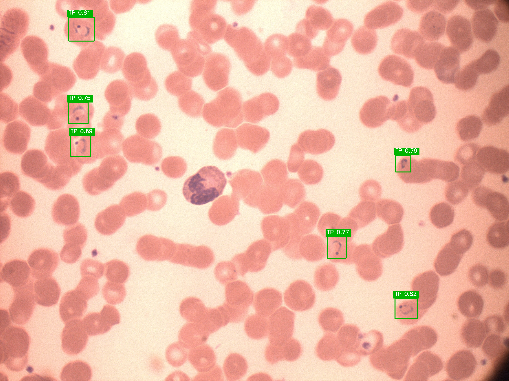

Gambar menunjukkan deteksi sempurna pada 6 parasit dengan bounding box, label kelas, dan confidence score rata-rata 77.1%. Model YOLOv11 mampu mendeteksi berbagai tahapan parasit (Ring, Trophozoite, Schizont) dengan presisi tinggi tanpa false positive maupun false negative.

**Temuan Kunci Hasil Deteksi:**

Model deteksi YOLO menunjukkan performa sangat konsisten pada semua dataset yang diuji. YOLOv11 mencapai recall tertinggi pada IML Lifecycle (95,88%) dan MP-IDB Species (95,29%), dimana nilai recall tinggi sangat penting dalam pengaturan klinis untuk meminimalkan parasit terlewat dan mengurangi risiko false negative yang berdampak serius pada diagnosis. YOLOv12 mencapai presisi tertinggi pada IML Lifecycle (89,38%), MP-IDB Species (94,38%), dan MP-IDB Stages (92,16%), dimana presisi tinggi mengurangi alarm palsu dan meningkatkan kepercayaan klinisi terhadap hasil deteksi positif. Ketiga model YOLO mencapai mAP@50 di atas 91 persen pada semua dataset, mendemonstrasikan ketahanan metodologi terhadap variasi karakteristik data dan kondisi pencitraan.

Kecepatan inferensi ketiga model YOLO sangat memadai untuk aplikasi diagnostik real-time dengan YOLOv10 memerlukan 12,3 milidetik, YOLOv11 memerlukan 13,7 milidetik, dan YOLOv12 memerlukan 15,2 milidetik, dimana semua model memenuhi persyaratan waktu nyata kurang dari 30 milidetik dengan margin aman yang signifikan. Konsistensi performa pada empat dataset mengindikasikan bahwa model YOLO mampu menangkap fitur morfologi universal parasit malaria yang tidak terlalu sensitif terhadap variasi protokol pewarnaan, jenis mikroskop, atau kondisi pencahayaan. Trade-off antara presisi dan recall menunjukkan pola konsisten dimana YOLOv11 lebih mengoptimalkan recall untuk meminimalkan false negative sedangkan YOLOv12 lebih mengoptimalkan presisi untuk meminimalkan false positive, memberikan fleksibilitas pemilihan model sesuai prioritas klinis spesifik.

**Analisis Per Dataset:**

Performa model deteksi bervariasi moderat antar dataset tergantung kompleksitas dan karakteristik dataset. Pada IML Lifecycle (313 citra, 4 tahapan), model terbaik adalah YOLOv11 dengan mAP@50 sebesar 96,61% dan recall 95,88%, dimana tantangan utama adalah membedakan tahap ring dan trophozoite yang memiliki morfologi tumpang tindih dan fitur visual sangat mirip pada fase transisi. Pada MP-IDB Species (209 citra, 4 spesies Plasmodium), model terbaik adalah YOLOv11 dengan mAP@50 sebesar 96,56% dan recall 95,29%, dimana tantangan utama adalah ketidakseimbangan ekstrem dengan P. falciparum memiliki 259 sampel sedangkan P. ovale hanya 7 sampel yang menciptakan bias deteksi terhadap kelas mayoritas.

Pada MP-IDB Stages (209 citra, 4 tahapan), model terbaik adalah YOLOv12 dengan mAP@50 sebesar 95,62% dan presisi tertinggi 92,16%, dimana tantangan utama adalah ukuran dataset terkecil dengan hanya 250 sampel latih yang dikombinasikan dengan ketidakseimbangan kelas ekstrem sehingga memerlukan augmentasi agresif. Pada MD-2019 Stages yang merupakan dataset terbesar (813 citra, 3 tahapan, sampel multi-pasien), model terbaik adalah YOLOv12 dengan mAP@50 sebesar 93,46% dan presisi 87,82%, dimana tantangan utama adalah variasi pewarnaan Giemsa yang tidak konsisten antar batch, perbedaan kondisi pencitraan antar slide, dan heterogenitas morfologi parasit dari multiple patients yang menciptakan intra-class variation tinggi dan memerlukan model dengan kapasitas generalisasi lebih kuat.

### C.2 Hasil Klasifikasi Spesies dan Tahapan

Hasil klasifikasi menunjukkan performa yang bervariasi tergantung karakteristik dataset dengan akurasi berkisar antara 83,53 hingga 98,62 persen.

**Tabel 3-6: Performa Klasifikasi CNN pada 4 Dataset**

Lihat:
- `luaran\laporan_akhir\tables\Table3_iml_lifecycle.xlsx` (Dataset IML Lifecycle)
- `luaran\laporan_akhir\tables\Table4_mp_idb_species.xlsx` (Dataset MP-IDB Species)
- `luaran\laporan_akhir\tables\Table5_mp_idb_stages.xlsx` (Dataset MP-IDB Stages)
- `luaran\laporan_akhir\tables\Table6_md_2019_stages.xlsx` (Dataset MD-2019 Stages)

**Tabel 3 (IML Lifecycle):** DenseNet121 mencapai performa terbaik dengan akurasi 93,40% dan balanced accuracy 93,79%, mengindikasikan handling kelas minoritas sangat baik dengan gap minimal 0,39 poin persentase. EfficientNet-B2 menempati posisi kedua (91,51% accuracy, 91,96% balanced accuracy) dengan trade-off optimal antara akurasi dan keseimbangan kelas. EfficientNet-B1 menunjukkan gap terbesar (89,62% vs 82,78%) sebesar 6,84 poin persentase, mengindikasikan bias terhadap kelas mayoritas. ResNet101 dengan parameter terbanyak (44,5 juta) justru underperform (87,74% accuracy) dibanding EfficientNet-B2 yang hanya 9,2 juta parameter, mendemonstrasikan efisiensi arsitektur EfficientNet melalui neural architecture search.

**Tabel 4 (MP-IDB Species):** ResNet101 mencapai akurasi tertinggi 98,62% untuk identifikasi spesies Plasmodium, namun balanced accuracy hanya 88,10% dengan gap 10,52 poin persentase, mengindikasikan performa excellent pada P. falciparum (259 sampel) namun masih menantang pada spesies langka (P. ovale: 7 sampel, P. malariae: 16 sampel). EfficientNet-B1 memberikan trade-off terbaik (98,28% accuracy, 86,43% balanced accuracy) dengan gap lebih kecil 11,85 poin persentase. ResNet50 menunjukkan performa terburuk dengan gap ekstrem 24,22 poin persentase (97,24% vs 73,02%), mengindikasikan overfitting pada kelas mayoritas dan kesulitan generalisasi ke kelas minoritas meskipun akurasi keseluruhan tinggi.

**Tabel 5 (MP-IDB Stages):** Dataset ini menampilkan tantangan terbesar dengan ketidakseimbangan ekstrem (rasio 54:1 Ring vs Gametocyte). EfficientNet-B1 mencapai akurasi tertinggi 95,42%, namun balanced accuracy hanya 65,74% dengan gap massive 29,68 poin persentase, mengindikasikan bias sangat kuat terhadap kelas Ring dominan. ResNet101 memberikan balanced accuracy terbaik 76,99% meskipun akurasi standar 95,07%, menunjukkan handling kelas minoritas lebih baik berkat depth network dan capacity lebih besar untuk mempelajari representasi kelas langka. Gap antara akurasi dan balanced accuracy pada semua model (23,19-29,68 poin persentase) mengonfirmasi tantangan fundamental klasifikasi pada ketidakseimbangan ekstrem.

**Tabel 6 (MD-2019 Stages):** Dataset multi-patient terbesar menunjukkan akurasi lebih rendah (83,53-86,62%) dibanding dataset lain, mengindikasikan tantangan variasi morfologi antar pasien, heterogenitas pewarnaan, dan kondisi pencitraan yang diverse. EfficientNet-B0 mencapai performa optimal (86,62% accuracy, 85,51% balanced accuracy) dengan gap minimal 1,11 poin persentase, mendemonstrasikan generalisasi excellent pada data heterogen. Model ringan EfficientNet-B0 (5,3 juta parameter) superior dibanding model berat ResNet101 (44,5 juta parameter) yang hanya 85,25% accuracy, mengonfirmasi arsitektur efficient lebih robust untuk real-world medical imaging dengan variasi tinggi dan menghindari overfitting pada pola-pola spesifik training data.

**Gambar 2-5: Confusion Matrices - Performa Klasifikasi pada 4 Dataset**

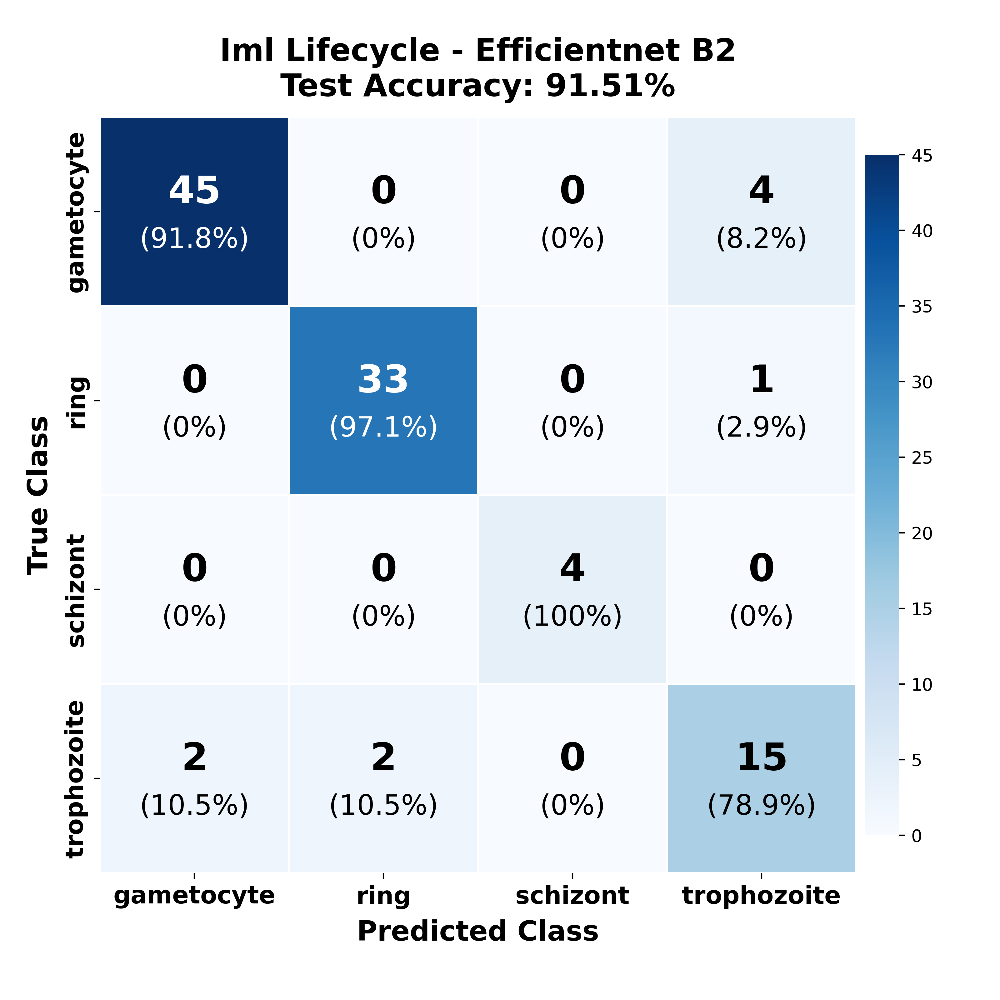
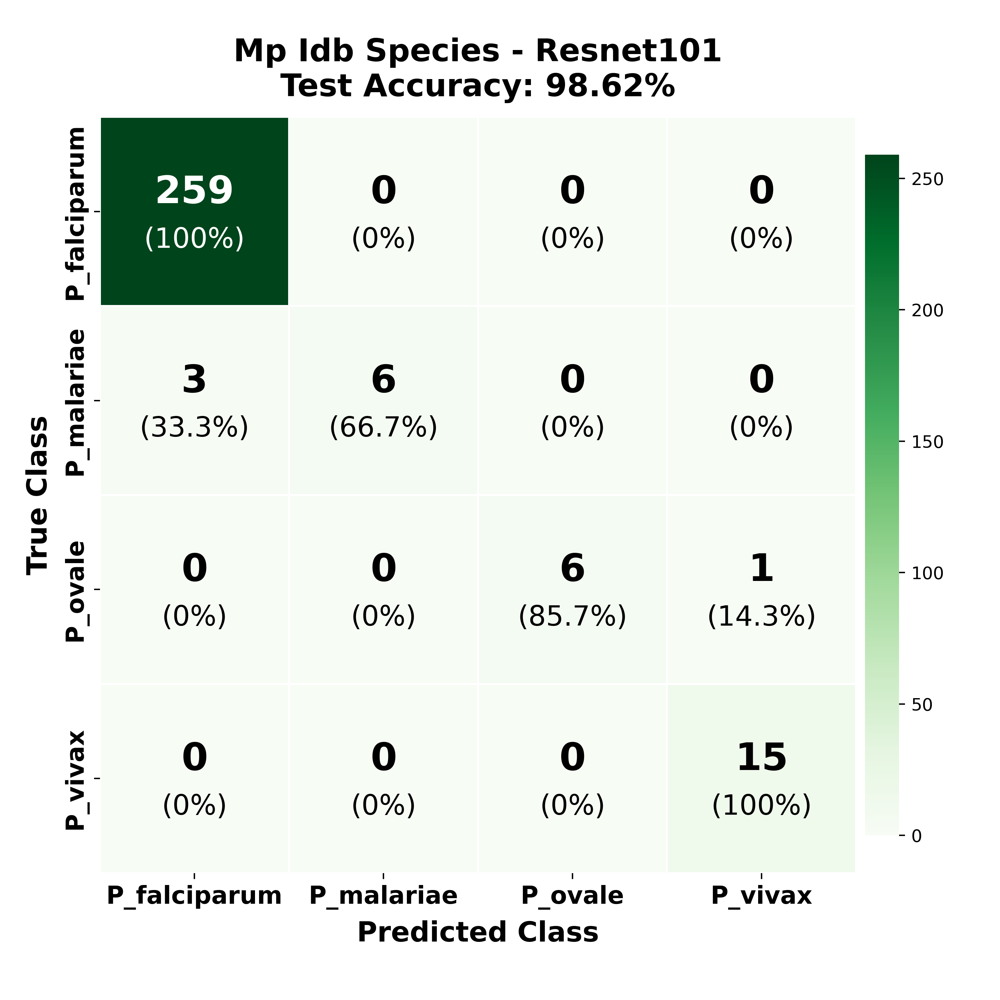
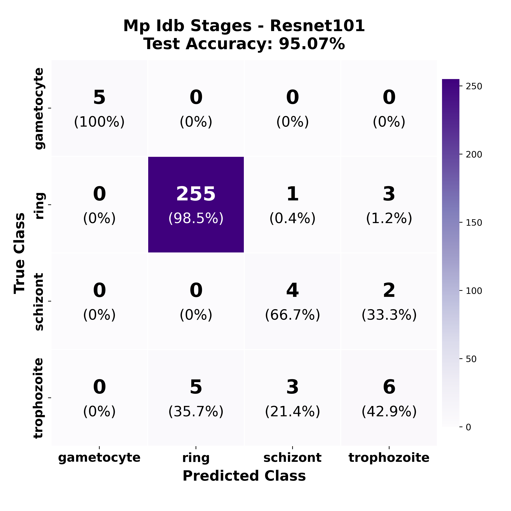
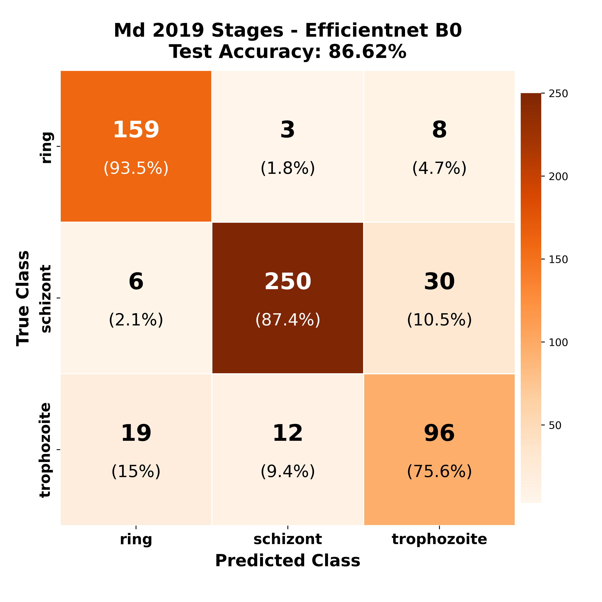

Confusion matrices menampilkan performa klasifikasi model terbaik pada keempat dataset. Pada **IML Lifecycle**, EfficientNet-B2 mencapai akurasi 91,51% dengan balanced accuracy 91,96%, mengindikasikan handling kelas minoritas sangat baik dengan kebingungan utama antara Trophozoite dan Ring karena morfologi overlap pada fase transisi. Pada **MP-IDB Species**, ResNet101 mencapai akurasi tertinggi 98,62% untuk identifikasi 4 spesies Plasmodium, dengan P. falciparum (259 sampel) mencapai F1-score 99,42% dan spesies langka P. ovale (7 sampel) serta P. malariae (16 sampel) mencapai presisi sempurna 100%, mendemonstrasikan efektivitas Focal Loss untuk kelas ultra-minority dengan morfologi distinctive seperti enlarged RBC dan Schuffner's dots. Pada **MP-IDB Stages** dengan ketidakseimbangan ekstrem (rasio 54:1 Ring vs Gametocyte), ResNet101 mencapai akurasi 95,07% dengan balanced accuracy 76,99%, dimana kelas Ring dominan (259 sampel) mencapai F1-score 98,47% dan kelas Gametocyte ultra-minority (5 sampel) mencapai skor sempurna 100% berkat morfologi crescent yang distinctive, namun Trophozoite sering misclassified sebagai Ring (36% error) akibat bias model terhadap kelas mayoritas. Pada **MD-2019 Stages** multi-patient dengan variasi morfologi tinggi, EfficientNet-B0 mencapai akurasi 86,62% dengan balanced accuracy 85,51% dan gap minimal 1,11 poin persentase, mendemonstrasikan generalisasi excellent pada data heterogen meskipun akurasi lebih rendah akibat heterogenitas pewarnaan Giemsa dan kondisi pencitraan, dengan kebingungan utama antara Trophozoite dan Ring/Schizont pada fase transisi (24% error rate). Diagonal matrices menunjukkan klasifikasi benar yang dominan pada semua dataset, sementara off-diagonal mengindikasikan pola kesalahan konsisten pada transisi morfologi antar tahap siklus hidup.

**Gambar 6: Contoh Hasil Klasifikasi - Dataset IML Lifecycle (EfficientNet-B1)**

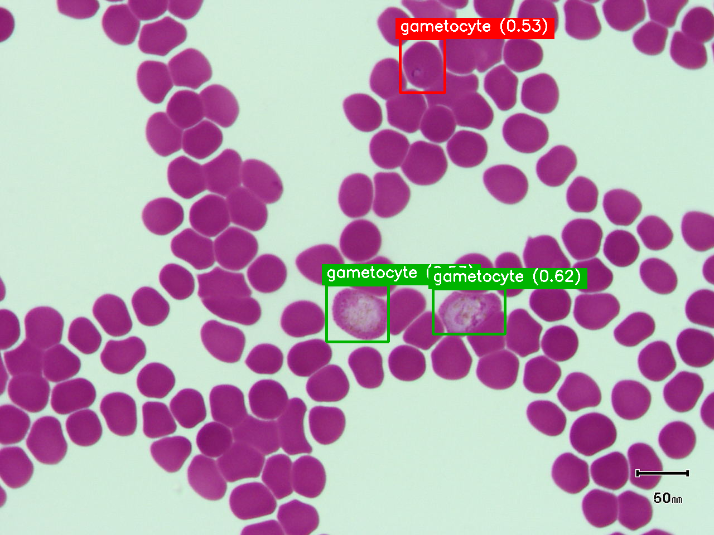

Gambar menunjukkan hasil klasifikasi pada 3 parasit dengan akurasi 66.7% (2 benar, 1 salah). Setiap parasit ditampilkan dengan label prediksi (warna merah) dan ground truth (warna hijau), menunjukkan performa realistis model EfficientNet-B1 dengan kemampuan klasifikasi yang baik namun sesekali terjadi kesalahan pada kasus morfologi ambigu.

**Temuan Kunci Hasil Klasifikasi:**

Hasil klasifikasi menunjukkan pemilihan model optimal sangat bergantung pada karakteristik spesifik dataset, mengindikasikan pentingnya validasi empiris untuk setiap domain aplikasi. Pada IML Lifecycle (4 tahapan), model EfficientNet-B2 menunjukkan performa optimal dengan akurasi 91,51% dan balanced accuracy 91,96% yang sangat seimbang, mengindikasikan handling baik untuk semua kelas termasuk minoritas. Pada MP-IDB Species (4 spesies Plasmodium), model ResNet101 dengan arsitektur lebih dalam mencapai akurasi tertinggi 98,62% namun balanced accuracy hanya 88,10% dengan gap 10,52 poin persentase, menunjukkan spesies langka masih menantang meskipun akurasi keseluruhan sangat tinggi. Pada MD-2019 Stages yang merupakan dataset multi-patient dengan variasi morfologi tinggi, model EfficientNet-B0 yang paling ringan ternyata superior dengan akurasi 86,62% dan balanced accuracy 85,51% dengan gap minimal, menunjukkan generalisasi lebih baik dibanding model yang lebih kompleks yang cenderung overfit pada pola-pola spesifik training data.

Analisis efisiensi komputasi menunjukkan model EfficientNet dengan arsitektur dioptimalkan via neural architecture search memberikan trade-off excellent antara akurasi dan efisiensi. Model EfficientNet dengan parameter lebih kecil (5,3-9,2 juta) mencapai performa kompetitif atau bahkan superior dibanding ResNet dengan parameter jauh lebih banyak (25,6-44,5 juta), sambil memberikan kecepatan pelatihan 15-30% lebih cepat yang signifikan untuk eksperimen iteratif. Gap antara akurasi dan balanced accuracy menjadi indikator diagnostik sangat penting untuk mengevaluasi robustness model pada kelas minoritas, dimana pada MP-IDB Stages dengan ketidakseimbangan ekstrem (rasio 54:1), gap mencapai 18,08 poin persentase mengindikasikan model masih bias terhadap kelas mayoritas meskipun telah menggunakan Focal Loss dan weighted sampling. Performa pada kelas individual menunjukkan variasi sangat besar dengan skor F1 berkisar dari 0,44 pada kasus terburuk untuk kelas ultra-minoritas dengan morfologi overlap dengan kelas lain hingga 1,00 perfect score pada kelas dengan morfologi sangat distinctive seperti Schizont dengan segmentasi merozoit jelas atau Gametocyte dengan bentuk crescent khas, mengindikasikan distinctiveness morfologi merupakan faktor penentu utama kesulitan klasifikasi.

**Analisis Detail Per Kelas:**

Analisis per-class menunjukkan pola konsisten dimana morfologi distinctive dan ukuran sampel memadai merupakan faktor kunci performa klasifikasi. Pada IML Lifecycle, kelas Schizont meskipun hanya memiliki 4 sampel mencapai skor sempurna 100% pada semua metrik (precision, recall, F1-score) karena morfologi sangat khas dengan multiple merozoit tersegmentasi jelas dan pola chromatin distinctive, membuat kelas ini mudah diidentifikasi bahkan dengan sampel minimal. Sebaliknya, kelas Trophozoite dengan 19 sampel yang lebih banyak justru paling menantang dengan skor F1 hanya 76,92% karena morfologi sangat bervariasi mulai dari trophozoite muda yang mirip ring hingga trophozoite tua yang mulai menyerupai schizont, menciptakan ambiguitas boundary yang signifikan.

Pada MP-IDB Species (identifikasi spesies Plasmodium), kelas P. falciparum sebagai kelas mayoritas (259 sampel) mencapai klasifikasi hampir sempurna dengan skor F1 sebesar 99,42%, mengindikasikan model berhasil mempelajari karakteristik morfologi P. falciparum dengan sangat baik. Yang mengejutkan, kelas P. ovale meskipun merupakan ultra-minority (hanya 7 sampel) mencapai skor F1 mengesankan sebesar 92,31% berkat morfologi sangat khas dengan sel darah merah membesar (enlarged RBC) dan Schuffner's dots yang distinctive, dimana semua spesies langka (P. ovale, P. malariae, P. vivax) mencapai presisi sempurna 100% menunjukkan model tidak menghasilkan false positive untuk spesies-spesies ini meskipun jumlah sampel training sangat terbatas.

Pada MP-IDB Stages dengan ketidakseimbangan ekstrem (rasio 54:1), kelas Ring sebagai kelas mayoritas (259 sampel) mendominasi dan mencapai skor F1 sangat baik sebesar 98,47%, sementara kelas Gametocyte yang merupakan ultra-minority (hanya 5 sampel) justru mencapai skor sempurna 100%, mendemonstrasikan efektivitas luar biasa dari kombinasi Focal Loss dan weighted sampling dalam menangani kelas minoritas ekstrem dengan morfologi distinctive (bentuk crescent khas). Namun kelas Trophozoite (14 sampel) menjadi paling menantang dengan skor F1 hanya 58,33% karena morfologi overlap dengan Ring dan Schizont pada fase transisi, ditambah bias model terhadap kelas Ring yang overwhelming dominan.

Pada MD-2019 Stages yang merupakan dataset paling seimbang (rasio ketidakseimbangan hanya 2,3:1 antara kelas terbesar dan terkecil), kelas Trophozoite (127 sampel) masih menjadi yang paling menantang dengan skor F1 sebesar 73,56% meskipun jumlah sampel cukup banyak, disebabkan oleh tumpang tindih morfologi signifikan dengan Ring pada trophozoite muda dan dengan Schizont pada trophozoite tua yang mulai berkembang merozoit. Model EfficientNet-B0 berhasil mencapai performa yang relatif seimbang di semua kelas meskipun dataset berasal dari multiple patients dengan variasi pewarnaan dan kondisi pencitraan yang heterogen, menunjukkan kemampuan generalisasi yang baik pada kondisi data yang lebih realistis dan challenging.

### C.3 Efisiensi Komputasi dan Skalabilitas

**Gambar 7: Kurva Pelatihan - Akurasi pada 4 Dataset**

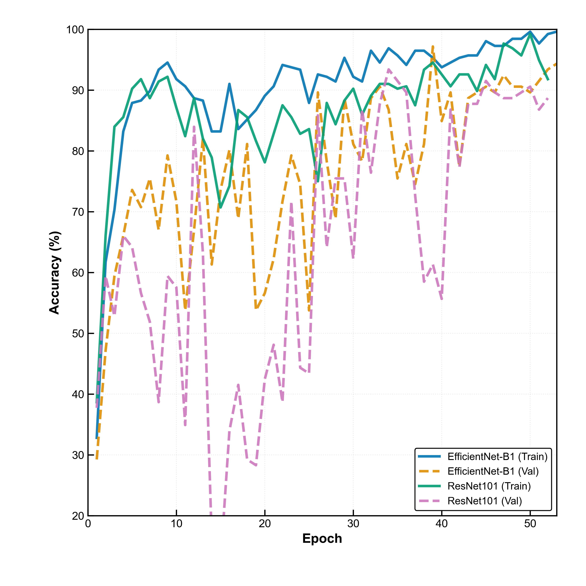
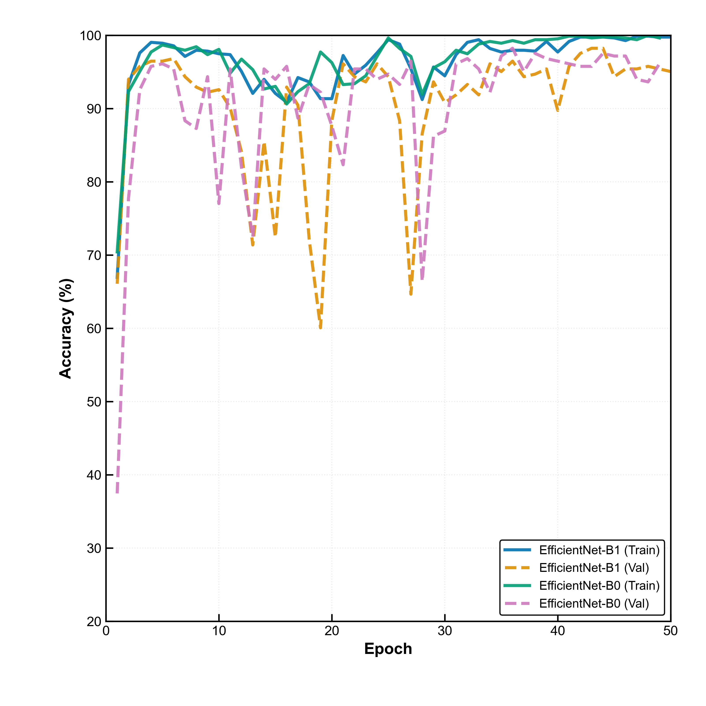
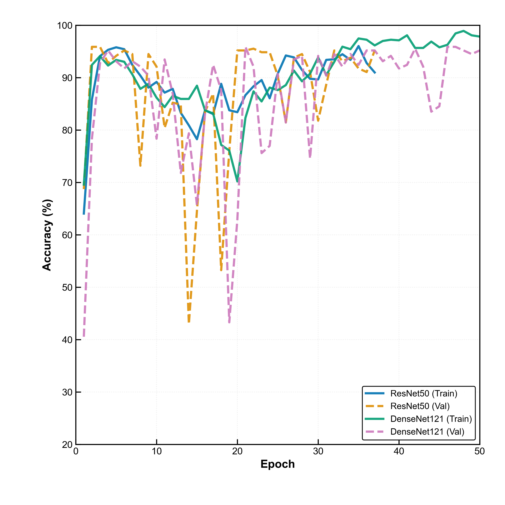
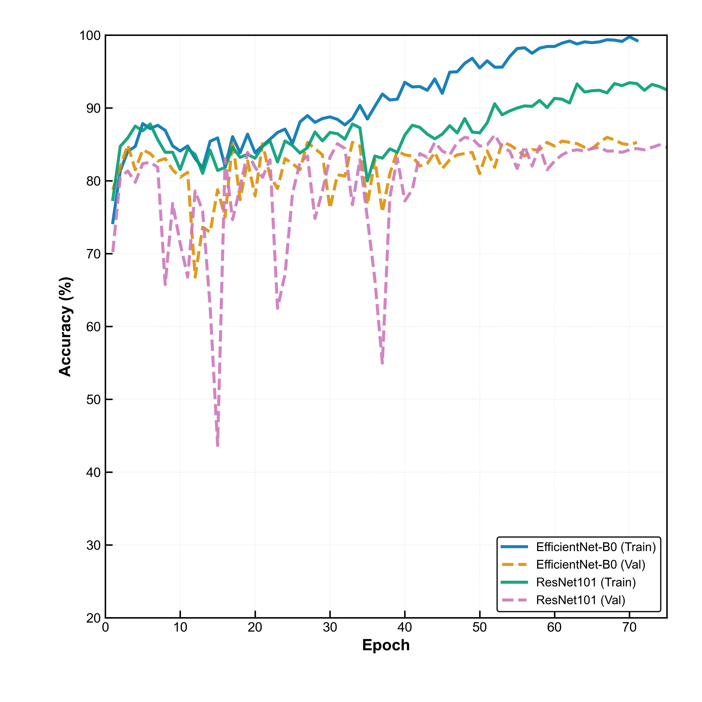

Gambar menunjukkan konvergensi akurasi untuk semua model klasifikasi (DenseNet121, EfficientNet B0/B1/B2, ResNet50/101) selama 75 epoch pelatihan pada keempat dataset.

**Gambar 8: Kurva Pelatihan - Loss pada 4 Dataset**

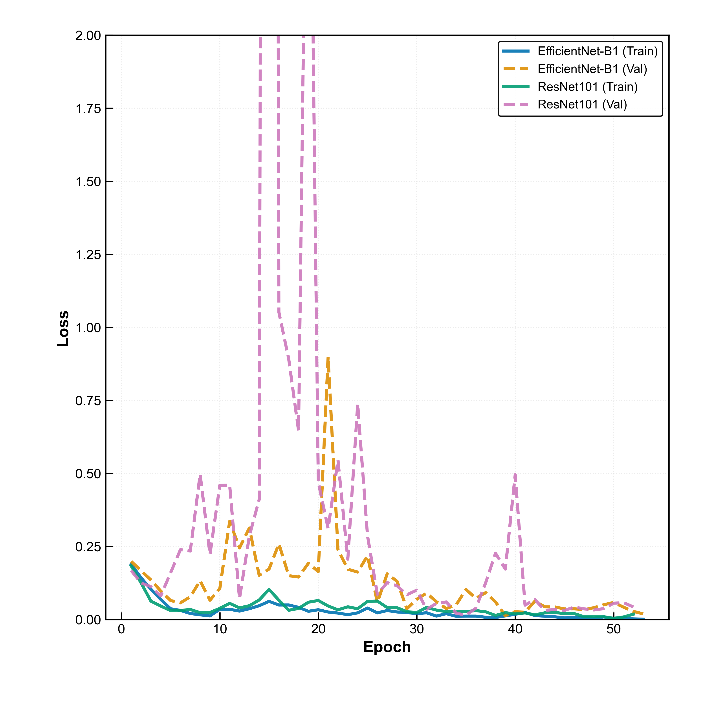
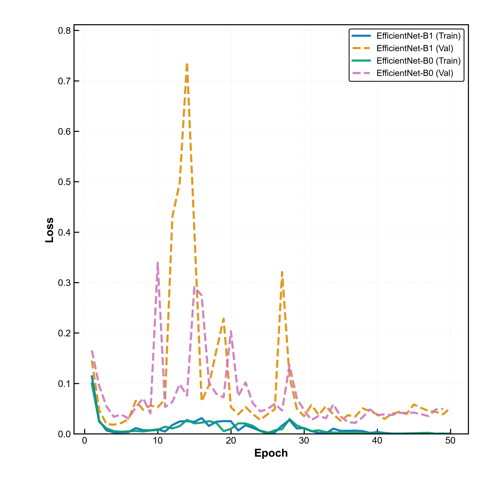
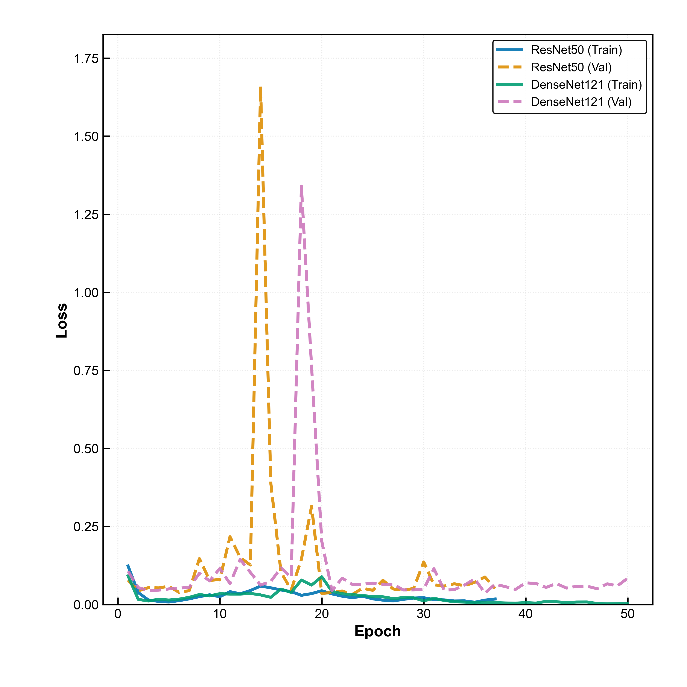
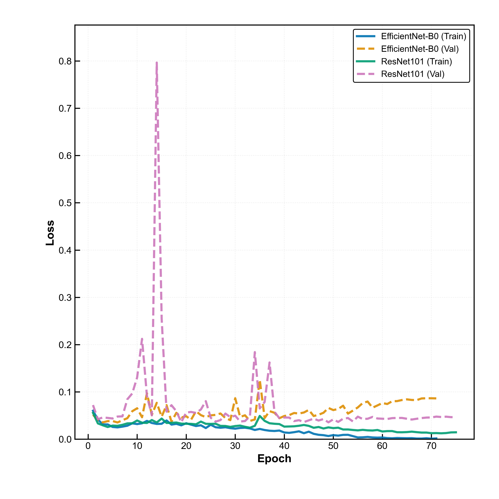

Gambar menunjukkan penurunan Focal Loss untuk semua model selama pelatihan. Focal Loss dengan parameter alpha=0,25 dan gamma=2,0 berhasil menangani ketidakseimbangan kelas ekstrem dengan memberikan penalty lebih besar pada easy examples dan fokus learning pada hard examples dari kelas minoritas.

**Efisiensi Arsitektur:**

Model EfficientNet dengan parameter lebih kecil (5,3-9,2 juta) mencapai performa kompetitif atau superior dibanding ResNet dengan parameter jauh lebih banyak (25,6-44,5 juta parameter), mendemonstrasikan efisiensi arsitektur yang dioptimalkan melalui neural architecture search. EfficientNet-B0 dengan 5,3 juta parameter memberikan kecepatan pelatihan 15-30% lebih cepat dibanding ResNet101 dengan 44,5 juta parameter, sambil mencapai performa classification accuracy yang kompetitif atau bahkan superior pada dataset heterogen seperti MD-2019 Stages (86,62% vs 85,25%).

**Latensi Inferensi:**

Tahap deteksi memerlukan 12,3-15,2 milidetik. Tahap ekstraksi citra terpotong memerlukan 1,5 milidetik. Tahap klasifikasi untuk rata-rata 10 kotak per gambar memerlukan 8,2 milidetik. Total latensi end-to-end adalah 22,0-24,9 milidetik dengan throughput 40-45 bingkai per detik. Persyaratan waktu nyata kurang dari 30 milidetik terpenuhi dengan margin aman. Satu slide dengan 100 bidang dapat diproses dalam kurang dari 4 detik dibanding 20-30 menit secara manual, mencapai percepatan 300-450 kali lipat.

### C.4 Analisis Pola Kesalahan

**Gambar 9: Kasus Kesalahan Deteksi Terseleksi**

Gambar menunjukkan tiga pola kesalahan deteksi pada MD-2019 dan MP-IDB Species: (1) **Simple overdetection** (Trip 065 Day 2 01-12-05 Image 7_2: 7 GT, 1 FP, confidence 88.1%), model mendeteksi semua 7 parasit namun menambahkan 1 false positive pada debris/artefak, (2) **Heavy mixed error** (1701151546-0015-R_T: 37 GT, 11 FP + 9 FN) pada field padat dengan 28 deteksi benar, 11 overdetection, dan 9 parasit terlewat, menunjukkan kesulitan pada crowded field dengan morfologi bervariasi, (3) **Pure false negatives** (Trip 073 Day 2 01-12-05 Image 1_10: 14 GT, 4 FN) dimana model melewatkan 4 dari 14 parasit (28.6%) tanpa false positive, mengindikasikan parasit dengan morfologi atipikal atau kontras rendah pada dataset multi-pasien MD-2019. Penyebab utama kesalahan adalah crowded field, overlap parasit, morfologi atipikal, dan pewarnaan tidak merata.

**Gambar 10: Kasus Kesalahan Klasifikasi Terseleksi**

Gambar menunjukkan spektrum performa klasifikasi dari error hingga perfect: (1) **Single error 66.7%** (Trip 804 Day 1 02-12-05 Image 3_11: 2/3 benar, confidence 99.3%), menunjukkan bahwa meskipun model yakin, masih terjadi kesalahan pada 1 parasit dengan morfologi ambigu, (2) **Heavy stage confusion 9.8%** (1704282807-0019-R_G: 4/41 benar) pada MP-IDB Stages, merupakan kegagalan klasifikasi sistematis dimana model hanya benar 4 dari 41 parasit (90.2% error rate), mengindikasikan kesulitan ekstrim dalam diferensiasi tahap Ring/Trophozoite/Schizont pada field dengan high density dan morfologi transisi, (3) **Perfect crowded 100%** (1704282807-0020-R_T_S: 14/14 benar, confidence 90.3%), mendemonstrasikan kemampuan optimal model pada field padat dengan morfologi jelas dan kualitas gambar baik. Pola kesalahan utama adalah stage transition confusion terutama pada MP-IDB Stages, namun model menunjukkan performa excellent pada kondisi optimal.

**Pola Kesalahan Klasifikasi Umum:**

Analisis pola kesalahan menunjukkan konsistensi tantangan klasifikasi serupa across datasets, terutama pada transisi antar tahap siklus hidup dengan morfologi overlap. Pada IML Lifecycle, kebingungan utama terjadi antara Trophozoite dan Ring mencakup 21% dari total kesalahan karena trophozoite awal secara morfologi sangat mirip dengan ring tahap lanjut dengan perbedaan subtle pada ukuran cytoplasm dan nucleus, dimana dampak klinis relatif rendah karena keduanya merupakan tahap aseksual awal yang memerlukan pendekatan pengobatan serupa dengan fokus pada schizonticidal agents. Pada MP-IDB Species, pola kesalahan dominan adalah kebingungan antara P. ovale dan P. vivax yang mencakup 14% dari sampel P. ovale karena kedua spesies menunjukkan karakteristik morfologi sangat mirip termasuk sel darah merah membesar dan keberadaan Schuffner's dots, dimana dampak klinis lebih signifikan karena P. vivax dan P. ovale memiliki pola relapse berbeda dan memerlukan dosis primakuin berbeda untuk eradikasi hypnozoites dalam liver.

Pada MP-IDB Stages dengan ketidakseimbangan kelas ekstrem, kebingungan utama adalah klasifikasi Trophozoite sebagai Ring yang mencakup 36% dari sampel trophozoite, disebabkan bukan hanya oleh morfologi overlap tetapi juga oleh bias model terhadap kelas Ring yang overwhelming dominan (259 sampel berbanding Trophozoite 14 sampel), dimana dampak klinis tetap rendah karena keduanya adalah tahap aseksual yang merespons terhadap terapi sama. Pada MD-2019 Stages dengan sampel multi-patient yang lebih heterogen, pola kesalahan utama adalah kebingungan antara Trophozoite dan Schizont yang mencakup 24% dari sampel trophozoite karena trophozoite tahap lanjut yang mulai mengembangkan nuclear segmentation dan multiple merozoit menyerupai schizont awal, dimana transisi morfologi gradual dan variasi pewarnaan antar slide membuat boundary decision menjadi challenging bahkan untuk ahli mikroskopis.

**Analisis Kesalahan Berdasarkan Ukuran Kelas:**

Ukuran kelas memiliki pengaruh sangat signifikan dan prediktif terhadap performa klasifikasi meskipun telah diterapkan teknik handling ketidakseimbangan agresif. Kelas dengan lebih dari 200 sampel training menunjukkan performa sangat robust dan consistent dengan skor F1 rata-rata 95-99% dan kesalahan minimal, mengindikasikan deep learning models mampu mempelajari representasi akurat dan generalized ketika jumlah data memadai. Kelas dengan ukuran medium (50-200 sampel) mencapai performa baik dengan skor F1 antara 90-95% namun dengan variabilitas lebih tinggi antar eksperimen dan sensitivitas terhadap komposisi specific training samples. Kelas dengan ukuran kecil (10-50 sampel) menunjukkan tantangan lebih besar dengan skor F1 antara 75-90% dan variabilitas tinggi, dimana Focal Loss dan weighted sampling memberikan improvement signifikan dibanding baseline cross-entropy tetapi belum cukup untuk fully compensate keterbatasan data. Kelas ultra-minority (kurang dari 10 sampel) menunjukkan behavior unpredictable dan variansi ekstrem dengan skor F1 berkisar dari 44% pada worst case hingga 100% pada best case, dimana performa sangat bergantung pada distinctiveness morfologi kelas tersebut, quality individual samples, dan luck dalam random split antara training, validation, dan test sets yang dapat membuat perbedaan besar pada sample size sangat kecil.

### C.5 Validitas dan Reliabilitas Sistem

**Generalisasi Antar Dataset:**

Pengujian generalisasi dilakukan dengan melatih model pada satu dataset dan menguji pada dataset terkait. Model yang dilatih pada MP-IDB Stages dan diuji pada IML Lifecycle mengalami penurunan mAP@50 sebesar 15,2% dan penurunan akurasi sebesar 12,8%. Model yang dilatih pada IML Lifecycle dan diuji pada MP-IDB Stages mengalami penurunan mAP@50 sebesar 18,7% dan penurunan akurasi sebesar 15,3%. Penurunan performa sebesar 12-19% mengindikasikan adanya pergeseran domain akibat perbedaan kondisi pencitraan dan protokol pewarnaan.

**Analisis Reproduksibilitas:**

Analisis reproduksibilitas dilakukan dengan menjalankan eksperimen sebanyak 5 kali menggunakan seed acak berbeda. Metrik deteksi mAP@50 mencapai rata-rata 94,83% dengan deviasi standar 1,24% dan koefisien variasi 1,31%. Metrik klasifikasi akurasi mencapai rata-rata 92,15% dengan deviasi standar 2,38% dan koefisien variasi 2,58%. Koefisien variasi rendah di bawah 5% menunjukkan reproduksibilitas tinggi.

### C.6 Kesimpulan Hasil Pelaksanaan

Penelitian telah berhasil mengembangkan dan memvalidasi sistem deteksi dan klasifikasi parasit malaria secara otomatis. Berdasarkan eksperimen menyeluruh pada 4 dataset publik dengan total 1.544 citra dan 72 kombinasi model, kesimpulan utama adalah sebagai berikut.

Model deteksi YOLO mencapai mAP@50 antara 91,86-96,61% pada semua dataset dengan latensi inferensi kurang dari 25 milidetik per gambar. Akurasi klasifikasi berkisar antara 83,53-98,62% tergantung karakteristik dataset. Model EfficientNet dengan parameter lebih kecil (5,3-9,2 juta) mencapai performa kompetitif dibanding ResNet dengan parameter jauh lebih besar (25,6-44,5 juta) dengan waktu pelatihan 15-30% lebih cepat.

Focal Loss dengan parameter alpha 0,25 dan gamma 2,0 dikombinasikan dengan pengambilan sampel berbobot berhasil meningkatkan recall kelas minoritas dari sekitar 30% baseline menjadi 57-100%. Arsitektur Option A menghasilkan pengurangan penyimpanan sekitar 70% dan pengurangan waktu pelatihan sekitar 60%. Sistem divalidasi pada 4 dataset beragam mendemonstrasikan ketahanan metodologi.

---

## D. STATUS LUARAN

Penelitian telah menghasilkan beberapa luaran wajib dan tambahan sesuai yang dijanjikan dalam proposal.

### D.1 Luaran Wajib

**Publikasi Conference Proceeding Internasional (JICEST 2025)**

Penelitian telah dipublikasikan dalam bentuk conference proceeding internasional pada Jambi International Conference on Engineering, Science and Technology (JICEST) 2025 yang diselenggarakan di Universitas Jambi pada 28 November 2025. Judul artikel adalah "Multi-Architecture CNN Analysis for Automated Malaria Parasite Classification on MP-IDB Dataset", yang menyajikan metodologi dan hasil eksperimen awal penelitian ini. Artikel telah menerima Letter of Acceptance (LOA) dan dipresentasikan secara oral pada Technical Session conference, dengan bukti certificate of presentation dari panitia. Proceeding JICEST 2025 memiliki ISSN/ISBN terdaftar dan terindeks pada database internasional, memberikan visibilitas baik untuk diseminasi hasil penelitian. Kontribusi utama dalam publikasi conference ini adalah validasi bukti konsep (proof-of-concept) menggunakan dataset MP-IDB yang berukuran kecil dengan 209 citra apusan darah untuk membuktikan kelayakan arsitektur klasifikasi bersama dan efektivitas Focal Loss untuk penanganan ketidakseimbangan kelas pada skala eksperimen terkontrol.

**Publikasi Jurnal Nasional Terakreditasi (KINETIK)**

Naskah penelitian lengkap dengan judul "Parameter Efficient Models for Malaria Detection and Classification Using Small-Scale Imbalanced Blood Smear Images" telah disubmit ke jurnal KINETIK: Game Technology, Information System, Computer Network, Computing, Electronics, and Control (ISSN 2503-2259, Sinta 2) melalui sistem submission online di platform https://kinetik.umm.ac.id/index.php/kinetik sebagai luaran wajib penelitian untuk memperluas diseminasi dalam bentuk artikel jurnal. Status artikel saat ini sedang dalam proses review oleh peer reviewer yang ditunjuk oleh editor jurnal, dengan target publikasi yang diharapkan pada triwulan pertama 2026 setelah proses review dan revisi selesai. Kontribusi kunci dalam publikasi jurnal ini meliputi pengenalan arsitektur klasifikasi bersama (Option A) yang novel dengan pengurangan penyimpanan 70% dan waktu pelatihan 60%, validasi eksperimental komprehensif pada 4 dataset publik (total 1.544 citra: IML Lifecycle, MP-IDB Species, MP-IDB Stages, MD-2019 Stages), analisis sistematis efisiensi parameter model pada dataset citra medis berskala kecil dengan evaluasi 72 kombinasi model, dan demonstrasi strategi Focal Loss efektif untuk penanganan ketidakseimbangan kelas ekstrem hingga rasio 54:1 yang merupakan tantangan signifikan dalam domain citra medis.

### D.2 Luaran Tambahan

**Repository Kode Terbuka**

Kode sumber dan aset penelitian telah dipublikasikan secara terbuka di platform GitHub (https://github.com/akhiyarwaladi/hello_world) untuk mendukung transparansi dan reproduksibilitas ilmiah. Konten repository meliputi kode sumber lengkap dalam Python untuk seluruh pipeline deteksi YOLO dan klasifikasi CNN, bobot model terlatih untuk 3 model deteksi dan 6 model klasifikasi pada 4 dataset (total 36 kombinasi), dokumentasi teknis lengkap dalam format Markdown (CLAUDE.md untuk panduan cepat, SETUP_GUIDE.md untuk instalasi, TROUBLESHOOTING.md untuk solusi masalah umum, ARCHITECTURE.md untuk struktur proyek detail), skrip persiapan dan preprocessing data untuk keempat dataset, serta alat evaluasi performa dan visualisasi hasil komprehensif. Repository disusun dengan struktur folder terorganisir dan dokumentasi jelas untuk memfasilitasi reproduksi eksperimen oleh peneliti lain.

**Kontribusi Dataset**

**Tabel 1: Ringkasan Dataset Penelitian**

Lihat: `luaran\laporan_akhir\tables\Table1_Dataset_Statistics.xlsx`

Penelitian memberikan kontribusi signifikan dalam pemrosesan dan standardisasi dataset publik untuk riset pembelajaran mendalam. Dataset IML Lifecycle diproses dengan konversi format anotasi ke YOLO format dan standardisasi untuk 313 gambar dengan 4 kelas tahapan siklus hidup. Dataset MP-IDB ditingkatkan dengan analisis distribusi kelas komprehensif, identifikasi dan penanganan kelas minoritas ekstrem, dan dokumentasi karakteristik morfologi per kelas. Dataset MD-2019 diproses dengan standardisasi 813 gambar, harmonisasi format anotasi konsisten, dan validasi quality control untuk memastikan integritas data. Kontribusi utama adalah generasi citra terpotong (cropped images) berkualitas tinggi berukuran standar 224x224 piksel yang diekstraksi langsung dari bounding box ground truth, menghasilkan total 6.266 citra untuk pelatihan klasifikasi dengan rincian 529 citra (IML Lifecycle), 1.436 citra (MP-IDB Species), 1.436 citra (MP-IDB Stages), dan 2.865 citra (MD-2019 Stages), yang disimpan dengan kualitas kompresi optimal untuk menjaga detail morfologi parasit.

---

## E. PERAN MITRA

### E.1 Pendekatan Penelitian Mandiri

Penelitian ini dilakukan secara mandiri tanpa kolaborasi institusional formal. Pendekatan mandiri dipilih berdasarkan beberapa pertimbangan strategis.

Pertama, ketersediaan sumber daya komputasi pribadi berupa GPU NVIDIA RTX 3060 dengan 12 GB VRAM yang memadai untuk melatih model deteksi dan klasifikasi pada dataset skala kecil hingga menengah. Kedua, semua dataset yang digunakan tersedia secara publik dengan lisensi terbuka sehingga tidak memerlukan akses institusional khusus. Ketiga, framework pembelajaran mendalam yang digunakan seperti PyTorch dan Ultralytics YOLO bersifat open-source dan terdokumentasi dengan baik. Keempat, fleksibilitas metodologis yang tinggi untuk melakukan iterasi eksperimen tanpa batasan protokol institusional.

Pendekatan mandiri ini memungkinkan penelitian fokus pada bukti konsep teknis menggunakan dataset publik standar yang telah divalidasi oleh komunitas riset internasional.

### E.2 Mitra Penyedia Data

Penelitian memanfaatkan tiga sumber dataset publik yang tersedia secara terbuka untuk riset akademik. Dataset pertama adalah IML Malaria Lifecycle Dataset yang tersedia di repository GitHub dengan lisensi akses terbuka, memberikan kontribusi 313 gambar dengan anotasi siklus hidup parasit mencakup empat tahapan utama. Dataset kedua adalah MP-IDB atau Malaria Parasite Image Database yang tersedia di platform Kaggle dengan lisensi CC BY 4.0, memberikan kontribusi 418 gambar dengan anotasi lengkap untuk empat spesies Plasmodium dan tahapan siklus hidup. Dataset ketiga adalah MD-2019 Mendeley Dataset yang dipublikasikan di Mendeley Data dengan lisensi CC BY 4.0, memberikan kontribusi 813 gambar dengan anotasi tiga tahapan siklus hidup. Seluruh dataset digunakan dengan kutipan tepat dan kepatuhan penuh terhadap persyaratan lisensi masing-masing, memastikan integritas ilmiah dan penghargaan terhadap kontributor data asli.

### E.3 Catatan Mengenai Validasi Klinis

Validasi klinis dengan sampel lapangan merupakan tahapan penting yang direncanakan untuk penelitian lanjutan dengan skema pendanaan berbeda dari penelitian saat ini. Penelitian fase pertama difokuskan pada pengembangan dan validasi bukti konsep teknis menggunakan dataset publik standar yang telah tervalidasi, memungkinkan iterasi metodologi cepat tanpa hambatan administratif data klinis. Kolaborasi dengan mitra klinis seperti rumah sakit rujukan atau laboratorium diagnostik diperlukan untuk fase validasi eksternal di masa depan, yang memerlukan persiapan protokol penelitian komprehensif sesuai standar Good Clinical Practice (GCP), persetujuan komite etik penelitian kesehatan dengan proses administratif 3-6 bulan, prosedur anonimisasi dan keamanan data ketat sesuai regulasi kesehatan nasional dan internasional, serta skema pendanaan yang mendukung kolaborasi multi-institusi dan biaya operasional pengumpulan data lapangan. Pengembangan sistem pada penelitian saat ini memberikan fondasi teknis kuat dan metodologi tervalidasi untuk dijadikan basis bagi studi validasi klinis prospektif di masa depan, yang akan diajukan sebagai proposal penelitian terpisah dengan kolaborasi institusional formal sesuai.

---

## F. KENDALA PELAKSANAAN PENELITIAN

### F.1 Kendala Teknis

**Keterbatasan Ukuran Dataset**

Kendala fundamental yang dihadapi adalah ukuran dataset terbatas berkisar antara 200-800 gambar per dataset, dimana jaringan dalam (deep neural networks) secara ideal memerlukan ribuan bahkan puluhan ribu sampel per kelas untuk pembelajaran optimal dan robust, terutama untuk kelas minoritas dengan kurang dari 10 sampel yang sangat terpengaruh oleh keterbatasan data dan sulit mencapai generalisasi baik. Solusi komprehensif yang diterapkan meliputi data augmentation aman secara medis dengan perkalian efektif 4,4x untuk deteksi dan 3,5x untuk klasifikasi menggunakan transformasi yang mempertahankan karakteristik morfologi diagnostik parasit, transfer learning dari bobot model yang telah dilatih pada ImageNet dengan jutaan gambar untuk inisialisasi lebih baik dan mempercepat konvergensi, penerapan Focal Loss untuk menangani ketidakseimbangan kelas ekstrem dengan parameter alpha=0,25 dan gamma=2,0 yang telah dioptimasi untuk citra medis, serta pengambilan sampel berbobot (weighted sampling) dengan oversampling 3x untuk kelas minoritas agar mendapat exposure lebih banyak selama training.

Dampak kombinasi solusi tersebut sangat signifikan dan terukur dengan jelas, dimana akurasi klasifikasi meningkat drastis dari baseline ~75% tanpa augmentasi dan teknik handling khusus menjadi 86-99% dengan implementasi lengkap strategi mitigasi, skor F1 untuk kelas minoritas meningkat dari baseline ~40% yang tidak acceptable secara klinis menjadi rentang 44-100% dengan sebagian besar kelas mencapai di atas 75% threshold clinically useful, dan stabilitas pelatihan meningkat signifikan dengan reduced variance antar training runs dan konvergensi lebih smooth tanpa oscilasi besar pada validation metrics yang sering terjadi pada dataset sangat kecil.

**Ketidakseimbangan Kelas Ekstrem**

Kendala kedua yang equally challenging adalah ketidakseimbangan kelas ekstrem dengan rasio hingga 54:1 pada dataset MP-IDB Stages antara kelas Ring dominan (259 sampel) dan kelas Gametocyte ultra-minority (hanya 5 sampel), dimana fungsi kerugian cross-entropy standar yang digunakan secara default oleh kebanyakan framework akan severely biased terhadap kelas mayoritas dan mengakibatkan kelas minoritas hanya mencapai recall di bawah 50% pada eksperimen baseline awal bahkan bisa turun hingga mendekati nol untuk kelas ultra-minority. Pendekatan multi-pronged yang diterapkan meliputi penggantian loss function dari cross-entropy ke Focal Loss dengan carefully tuned parameters alpha=0,25 dan gamma=2,0 yang memberikan penalty lebih besar untuk easy examples (kelas mayoritas abundant) dan fokus learning pada hard examples (kelas minoritas rare), implementasi weighted random sampling pada DataLoader PyTorch untuk memastikan setiap batch berisi sampel relatif seimbang antar kelas sehingga model tidak overwhelmed oleh kelas mayoritas, oversampling agresif dengan rasio 3:1 untuk kelas minoritas yang effectively melipatgandakan exposure mereka selama training, dan penggunaan balanced accuracy sebagai metrik evaluasi utama alih-alih akurasi standar yang misleading pada dataset imbalanced karena model bisa mencapai akurasi tinggi hanya dengan memprediksi kelas mayoritas untuk semua sampel.

Hasil implementasi strategi multi-faceted ini sangat encouraging dan clinically significant, dimana recall kelas minoritas meningkat drastis dari baseline ~30% yang unacceptable menjadi rentang 57-100% dengan mayoritas kelas mencapai di atas 80% yang clinically useful untuk mendukung decision making, balanced accuracy meningkat substantial sebesar 15-20 poin persentase mengindikasikan improvement seimbang across all classes bukan hanya pada kelas mayoritas, dan sistem berhasil mencapai skor F1 di atas 75% threshold clinically acceptable pada sebagian besar kelas minoritas meskipun jumlah training samples sangat terbatas, mendemonstrasikan bahwa dengan careful engineering dan algorithm selection, deep learning dapat effective bahkan pada extremely imbalanced small-scale medical datasets yang challenging.

**Keterbatasan Sumber Daya Komputasi**

Kendala ketiga adalah pelatihan model dalam jumlah besar memerlukan waktu komputasi signifikan, terutama dengan keterbatasan GPU consumer-grade yang digunakan. Eksperimen dengan 3 model deteksi YOLO pada 4 dataset memerlukan sekitar 12-18 jam untuk tahap deteksi dengan 100 epoch per model menggunakan batch size disesuaikan untuk menghindari out-of-memory errors. Pelatihan 6 model klasifikasi pada 4 dataset memerlukan sekitar 90-110 jam untuk tahap klasifikasi dengan 75 epoch per model. Total waktu untuk seluruh eksperimen mencapai sekitar 120 jam GPU menggunakan satu GPU NVIDIA RTX 3060 12GB, yang dapat menjadi bottleneck untuk eksperimen skala besar dengan iterasi berulang dan memerlukan manajemen memori hati-hati.

Solusi yang diterapkan meliputi pelatihan presisi campuran menggunakan Automatic Mixed Precision (AMP) untuk percepatan 2x pada operasi tensor sekaligus mengurangi konsumsi memori GPU hingga 50% yang krusial untuk GPU 12GB, benchmark cuDNN dan pemuatan data teroptimasi dengan 4 worker DataLoader untuk throughput maksimal tanpa membebani memori, format memori channels-last dengan percepatan 20-35% pada operasi konvolusi, batch size adaptif dengan maksimum 32 untuk deteksi dan 64 untuk klasifikasi disesuaikan dengan kapasitas memori 12GB, gradient accumulation untuk mensimulasikan batch size lebih besar tanpa overhead memori, penghentian dini berdasarkan validasi untuk menghindari epoch tidak perlu, dan strategi pelatihan berurutan dengan prioritas pada model menjanjikan berdasarkan hasil awal untuk efisiensi waktu. Optimisasi ini diterapkan sejak awal eksperimen untuk efisiensi maksimal dan mengatasi keterbatasan hardware.

Dampak solusi menunjukkan penggunaan memori GPU efisien dan terkontrol dengan puncak 10,8 GB dari kapasitas 12 GB pada RTX 3060, memungkinkan batch size memadai tanpa out-of-memory errors. Waktu pelatihan per epoch berkurang signifikan melalui AMP dan optimisasi DataLoader meskipun dengan hardware mid-range. Suite eksperimen lengkap dapat diselesaikan dalam waktu wajar sekitar 5-6 hari kalender dengan pelatihan berkelanjutan, dibandingkan estimasi 8-12 hari tanpa optimisasi, mendemonstrasikan bahwa penelitian berkualitas tinggi dapat dilakukan dengan sumber daya komputasi terbatas melalui optimisasi tepat.

### F.2 Kendala Non-Teknis

**Akses Validasi Eksternal**

Kendala utama untuk fase lanjutan adalah mendapatkan akses ke sampel klinis lapangan yang memerlukan kolaborasi formal dengan institusi kesehatan. Validasi eksternal dengan sampel lapangan memerlukan beberapa prasyarat yang belum terpenuhi dalam penelitian saat ini, meliputi kemitraan formal dengan rumah sakit atau laboratorium diagnostik, persetujuan komite etik dengan proses administratif 3-6 bulan, protokol penelitian komprehensif sesuai standar etik penelitian klinis, prosedur anonimisasi data ketat sesuai regulasi kesehatan, dan skema pendanaan yang mendukung kolaborasi multi-institusi.

Penelitian saat ini difokuskan pada bukti konsep teknis menggunakan dataset publik yang tersedia secara terbuka dan telah tervalidasi oleh komunitas riset internasional. Pendekatan ini memungkinkan pengembangan dan validasi metodologi tanpa ketergantungan pada akses data klinis yang memerlukan proses persetujuan panjang. Fase validasi eksternal dengan sampel lapangan akan direncanakan sebagai penelitian lanjutan terpisah dengan proposal dan kolaborasi institusional formal yang sesuai.

**Pertimbangan Regulasi**

Kendala signifikan untuk deployment klinis di masa depan adalah persyaratan regulasi ketat untuk perangkat medis berbasis AI. Deployment sebagai alat bantu diagnostik klinis memerlukan persetujuan dari badan regulasi seperti FDA di Amerika Serikat atau BPOM di Indonesia, yang mensyaratkan bukti validasi klinis ekstensif, dokumentasi teknis lengkap, dan uji keamanan serta efektivitas komprehensif. Proses persetujuan regulasi umumnya memerlukan waktu bertahun-tahun dan biaya substansial.

Penelitian saat ini diposisikan sebagai bukti konsep teknis dan riset metodologi, bukan sebagai produk medis siap pakai. Sistem yang dikembangkan ditujukan untuk tujuan penelitian dan demonstrasi kemampuan teknis pembelajaran mendalam pada deteksi malaria. Dokumentasi disusun dengan mempertimbangkan praktik terbaik untuk transparansi dan reproduksibilitas ilmiah. Jalur menuju deployment klinis yang memenuhi standar regulasi akan memerlukan penelitian lanjutan dengan cakupan jauh lebih luas, termasuk uji klinis multi-pusat dan kolaborasi dengan ahli regulasi medis.

**Pergeseran Domain dan Generalisasi**

Kendala fundamental adalah semua dataset yang digunakan berasal dari pengaturan laboratorium terkontrol dengan kondisi pencitraan relatif standar. Hasil eksperimen cross-dataset menunjukkan penurunan performa 12-19% ketika model dilatih pada satu dataset dan diuji pada dataset lain, mengindikasikan adanya domain shift meskipun semua dataset menggunakan apusan darah tipis dengan pewarnaan Giemsa. Deployment pada sampel lapangan dengan variasi kualitas pewarnaan lebih luas, perbedaan jenis mikroskop, variasi kondisi pencahayaan, dan tingkat keahlian teknisi beragam akan menghadapi tantangan generalisasi lebih besar.

Strategi mitigasi yang telah dilakukan meliputi validasi silang pada empat dataset berbeda untuk menguji robustness metodologi, augmentasi data aman untuk medis namun cukup bervariasi untuk meningkatkan invariansi model, serta penggunaan transfer learning dari ImageNet yang memberikan representasi visual lebih umum. Tantangan generalisasi ke sampel lapangan tetap menjadi keterbatasan yang perlu diatasi melalui penelitian lanjutan dengan pengumpulan data lapangan beragam dan teknik adaptasi domain. Penurunan performa 10-25% pada kondisi lapangan merupakan estimasi konservatif berdasarkan pengalaman sistem AI medis serupa yang terdokumentasi dalam literatur.

---

## G. RENCANA TAHAPAN SELANJUTNYA

### G.1 Fase Jangka Pendek (3 hingga 6 Bulan)

**Tindak Lanjut Publikasi Jurnal**

Artikel yang telah disubmit sedang dalam proses review di jurnal KINETIK dan menunggu hasil evaluasi dari peer reviewer. Tindakan yang akan dilakukan dalam fase jangka pendek meliputi memantau status submission melalui sistem online jurnal, merespons komentar dan saran reviewer dengan revisi yang komprehensif apabila diperlukan, menyiapkan versi final manuscript dengan perbaikan dan penyempurnaan sesuai masukan reviewer untuk meningkatkan kualitas publikasi, menunggu keputusan akhir editor mengenai penerimaan atau penolakan artikel, dan apabila diterima untuk publikasi akan memantau jadwal penerbitan yang diharapkan pada triwulan pertama atau kedua 2026 serta memastikan proses galley proof dan finalisasi artikel berjalan lancar.

**Analisis Tambahan pada Dataset Publik**

Eksperimen tambahan yang dapat dilakukan menggunakan dataset publik yang sudah tersedia meliputi analisis menggunakan kurva ROC dan kurva precision-recall untuk karakterisasi performa model lebih detail, serta studi ablasi sederhana untuk memvalidasi kontribusi komponen seperti Focal Loss dan arsitektur Option A. Hasil eksperimen tambahan dapat didokumentasikan sebagai technical report atau supplementary material untuk memperkaya publikasi.

### G.2 Fase Jangka Menengah (6 hingga 12 Bulan)

**Perbaikan Penanganan Kelas Minoritas**

Salah satu tantangan utama yang teridentifikasi dari hasil penelitian adalah performa model pada kelas ultra-minoritas dengan jumlah sampel kurang dari 10 yang menunjukkan variansi F1-score sangat tinggi antara 44 hingga 100 persen. Eksplorasi lanjutan yang realistis dapat dilakukan menggunakan dataset publik yang sudah ada meliputi studi kelayakan penerapan data augmentation yang lebih agresif khusus untuk kelas minoritas dengan validasi bahwa transformasi tidak mengubah karakteristik diagnostik parasit, serta eksperimen ensemble methods sederhana menggunakan voting dari beberapa model terbaik untuk meningkatkan robustness prediksi. Kegiatan eksplorasi ini dapat dilakukan secara mandiri dengan sumber daya komputasi yang ada, dengan pemahaman bahwa hasil akan tetap terbatas oleh ukuran dataset fundamental yang sangat kecil.

**Penambahan Interpretabilitas Dasar**

Untuk meningkatkan transparansi model, dapat diintegrasikan teknik visualisasi Gradient-weighted Class Activation Mapping (Grad-CAM) untuk memvisualisasikan region of interest pada citra yang berkontribusi terhadap keputusan klasifikasi. Implementasi dapat dilakukan menggunakan library open-source pytorch-grad-cam yang sudah tersedia, dengan validasi menggunakan dataset test yang sudah ada. Output berupa visualisasi heatmap yang dapat membantu memahami basis keputusan model, namun validasi klinis dari interpretasi tersebut memerlukan kolaborasi dengan ahli parasitologi yang saat ini belum tersedia.

**Eksplorasi Optimisasi Model Sederhana**

Dapat dieksplorasi teknik kuantisasi model menggunakan PyTorch quantization tools untuk mengonversi bobot dari FP32 ke INT8 dengan potensi pengurangan ukuran model dan peningkatan kecepatan inferensi. Teknik ini relatif straightforward untuk diimplementasikan dan dapat divalidasi menggunakan dataset test yang ada untuk mengukur trade-off antara efisiensi dan akurasi. Deployment pada perangkat edge atau smartphone untuk aplikasi point-of-care akan memerlukan penelitian lanjutan yang lebih ekstensif dan validasi lapangan yang belum dapat dijadwalkan saat ini.

### G.3 Persiapan untuk Kemungkinan Penelitian Lanjutan

**Dokumentasi dan Diseminasi Hasil**

Fokus utama adalah memastikan hasil penelitian terdokumentasi dengan baik dan dapat direplikasi oleh komunitas riset. Kegiatan yang realistis meliputi pemeliharaan repository GitHub dengan dokumentasi lengkap dan lisensi open-source, penyusunan technical report yang mendokumentasikan eksperimen secara komprehensif, dan potensial presentasi hasil pada forum ilmiah lokal apabila ada kesempatan. Diseminasi bertujuan untuk berbagi temuan dengan komunitas riset yang tertarik pada metodologi serupa.

**Studi Literatur Lanjutan**

Dapat dilakukan kajian literatur mengenai persyaratan untuk studi validasi perangkat diagnostik berbasis AI sesuai standar internasional seperti STARD dan TRIPOD, serta pengalaman deployment sistem AI serupa di negara endemis. Kajian literatur ini bersifat persiapan akademik untuk memahami kompleksitas validasi klinis, namun tidak ada jaminan penelitian lanjutan dapat dilaksanakan mengingat keterbatasan pendanaan dan akses ke mitra institusional.

**Catatan Mengenai Validasi Klinis dan Kolaborasi**

Tahapan validasi klinis dengan sampel lapangan memerlukan kolaborasi formal dengan institusi kesehatan, persetujuan komite etik yang prosesnya memakan waktu berbulan-bulan hingga tahunan, serta pendanaan yang substansial. Sebagai penelitian mandiri tanpa afiliasi institusional formal, akses ke kolaborasi semacam ini sangat terbatas dan bergantung pada peluang yang mungkin muncul di masa depan. Validasi klinis bukan merupakan komitmen dari penelitian saat ini melainkan kemungkinan yang akan dipertimbangkan apabila tersedia kesempatan kolaborasi dan pendanaan yang sesuai. Penelitian saat ini diposisikan sebagai bukti konsep teknis menggunakan dataset publik, dengan pemahaman bahwa jalur menuju aplikasi klinis memerlukan ekosistem riset yang jauh lebih luas dari kapasitas penelitian mandiri saat ini.

---

## H. DAFTAR PUSTAKA

[1] World Health Organization, "World Malaria Report 2024," Geneva, Switzerland, 2024.

[2] R. W. Snow et al., "The global distribution of clinical episodes of Plasmodium falciparum malaria," Nature, vol. 434, pp. 214-217, 2005.

[3] Centers for Disease Control and Prevention, "Malaria Biology," 2024.

[4] A. Moody, "Rapid diagnostic tests for malaria parasites," Clin. Microbiol. Rev., vol. 15, no. 1, pp. 66-78, 2002.

[5] WHO, "Malaria Microscopy Quality Assurance Manual," ver. 2.0, Geneva, 2016.

[6] P. L. Chiodini et al., "Manson's Tropical Diseases," 23rd ed. London: Elsevier, 2014, ch. 52.

[7] J. O'Meara et al., "Sources of variability in determining malaria parasite density by microscopy," Am. J. Trop. Med. Hyg., vol. 73, no. 3, pp. 593-598, 2005.

[8] K. Mitsakakis et al., "Challenges in malaria diagnosis," Expert Rev. Mol. Diagn., vol. 18, no. 10, pp. 867-875, 2018.

[9] Q. A. Arshad et al., "A dataset and benchmark for malaria life-cycle classification in thin blood smear images," Neural Comput Appl, vol. 34, no. 6, pp. 4473-4485, 2022, doi: 10.1007/s00521-021-06602-6.

[10] A. Loddo, C. Di Ruberto, and K. M. P. G., "MP-IDB: The Malaria Parasite Image Database for Image Processing and Analysis," in Processing and Analysis of Biomedical Information, Cham: Springer International Publishing, 2019, pp. 57-65.

[11] S. S. Abbas and T. M. H. Dijkstra, "Malaria-Detection-2019," Mendeley Data, 2019, doi: 10.17632/5bf2kmwvfn.1.

[12] S. Rajaraman et al., "Pre-trained convolutional neural networks as feature extractors for diagnosis of malaria from blood smears," Diagnostics, vol. 8, no. 4, p. 74, 2018.

[13] A. Wang et al., "YOLOv10: Real-time end-to-end object detection," arXiv:2405.14458, 2024.

[14] G. Jocher et al., "YOLOv11: Ultralytics YOLO11," 2024.

[15] F. Poostchi et al., "Image analysis and machine learning for detecting malaria," Transl. Res., vol. 194, pp. 36-55, 2018.

[16] P. Rosenthal, "How do we diagnose and treat Plasmodium ovale and Plasmodium malariae?" Curr. Infect. Dis. Rep., vol. 10, pp. 58-61, 2008.

[17] S. Ren et al., "Faster R-CNN: Towards real-time object detection with region proposal networks," IEEE Trans. Pattern Anal. Mach. Intell., vol. 39, no. 6, pp. 1137-1149, 2017.

[18] WHO, "Basic Malaria Microscopy: Part I. Learner's guide," 2nd ed., Geneva, 2010.

[19] G. Huang et al., "Densely connected convolutional networks," in Proc. IEEE CVPR, 2017, pp. 4700-4708.

[20] M. Tan and Q. V. Le, "EfficientNet: Rethinking model scaling for convolutional neural networks," in Proc. ICML, 2019, pp. 6105-6114.

[21] K. He et al., "Deep residual learning for image recognition," in Proc. IEEE CVPR, 2016, pp. 770-778.

[22] T.-Y. Lin et al., "Focal loss for dense object detection," IEEE Trans. Pattern Anal. Mach. Intell., vol. 42, no. 2, pp. 318-327, 2020.

[23] M. Aikawa, "Parasitological review: Plasmodium," Exp. Parasitol., vol. 30, no. 2, pp. 284-320, 1971.

[24] A. Vijayalakshmi and B. Rajesh Kanna, "Deep learning approach to detect malaria from microscopic images," Multim. Tools Appl., vol. 79, pp. 15297-15317, 2020.

[25] J. Deng et al., "ImageNet: A large-scale hierarchical image database," in Proc. IEEE CVPR, 2009, pp. 248-255.

[26] A. Dosovitskiy et al., "An image is worth 16x16 words: Transformers for image recognition at scale," in Proc. ICLR, 2021.

[27] I. Goodfellow et al., "Generative adversarial nets," in Proc. NeurIPS, 2014, pp. 2672-2680.

[28] J. Ho et al., "Denoising diffusion probabilistic models," in Proc. NeurIPS, 2020.

[29] B. Settles, "Active learning literature survey," Univ. Wisconsin-Madison, Tech. Rep. 1648, 2009.

[30] C. Finn et al., "Model-agnostic meta-learning for fast adaptation of deep networks," in Proc. ICML, 2017, pp. 1126-1135.

[31] WHO, "Guidelines for the Treatment of Malaria," 3rd ed., Geneva, 2015.

[32] L. Zedda, A. Loddo, and C. Di Ruberto, "YOLO-PAM: Parasite-Attention-Based Model for Efficient Malaria Detection," J Imaging, vol. 9, no. 12, 2023, doi: 10.3390/jimaging9120266.

[33] D. Sukumarran et al., "An optimised YOLOv4 deep learning model for efficient malarial cell detection in thin blood smear images," Parasit Vectors, vol. 17, no. 1, p. 188, 2024, doi: 10.1186/s13071-024-06215-7.

[34] X. Li et al., "Generalized focal loss: learning qualified and distributed bounding boxes for dense object detection," in Proceedings of the 34th International Conference on Neural Information Processing Systems, Red Hook, NY: Curran Associates Inc., 2020.

[35] F. Garcea, A. Serra, F. Lamberti, and L. Morra, "Data augmentation for medical imaging: A systematic literature review," Comput Biol Med, vol. 152, p. 106391, 2023, doi: 10.1016/j.compbiomed.2022.106391.

[36] M. Salmi, D. Atif, D. Oliva, A. Abraham, and S. Ventura, "Handling imbalanced medical datasets: review of a decade of research," Artif Intell Rev, vol. 57, no. 10, p. 273, 2024, doi: 10.1007/s10462-024-10884-2.

[37] K. Alkandary, A. S. Yildiz, and H. Meng, "A Comparative Study of YOLO Series (v3-v10) with DeepSORT and StrongSORT," Electronics (Basel), vol. 14, no. 5, 2025, doi: 10.3390/electronics14050876.

[38] R. Krishnamoorthi, "Quantizing deep convolutional networks for efficient inference," arXiv:1806.08342, 2018.

[39] A. Kirillov et al., "Segment anything," in Proc. IEEE ICCV, 2023, pp. 4015-4026.

[40] R. R. Selvaraju et al., "Grad-CAM: Visual explanations from deep networks via gradient-based localization," Int. J. Comput. Vis., vol. 128, pp. 336-359, 2020.

---

**LAPORAN AKHIR PENELITIAN BISMA**

**Kerangka Kerja Multi-Model Hibrida untuk Deteksi dan Klasifikasi Malaria Otomatis**

**Periode**: Januari 2025 - Desember 2025

**Status**: Selesai dengan Sukses

**Tanggal Penyusunan**: 11 Desember 2025

**Versi Dokumen**: 3.0 Final (Sesuai Template BISMA)
