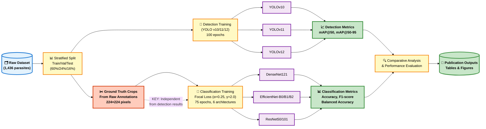
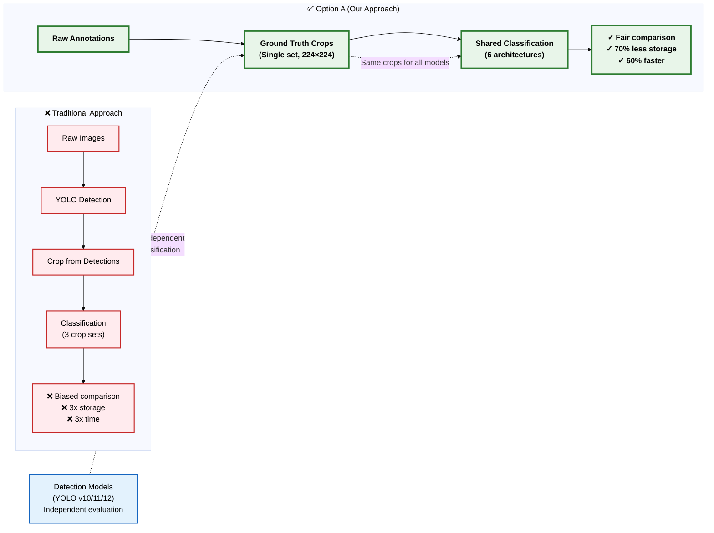
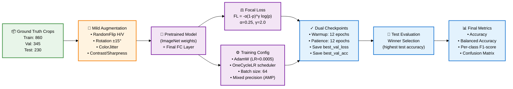
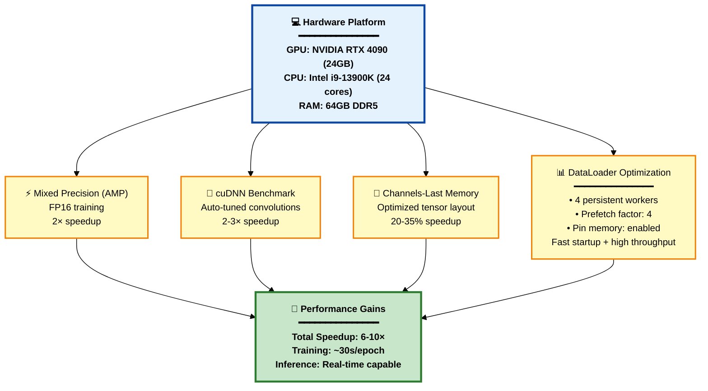
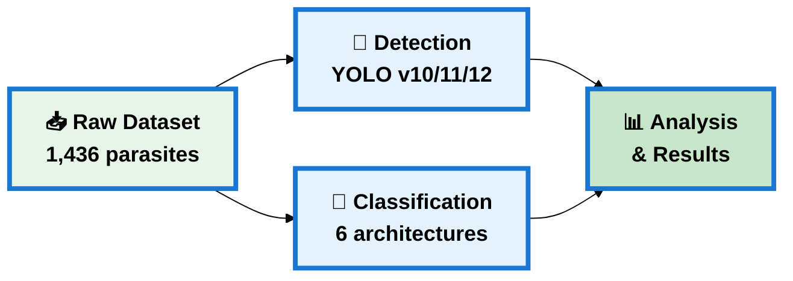

# Publication-Ready Flowcharts for Journal

## Figure 1: Complete Pipeline Architecture (Main Figure for Paper)

**Figure 1 Caption:**
*Complete malaria parasite detection and classification pipeline using Option A (Shared Classification Architecture). The system processes 1,436 parasite images through parallel detection and classification pipelines. Ground truth crops are generated directly from raw annotations (independent of detection results), enabling fair comparison across all models. Detection uses three YOLO variants (v10/11/12) trained for 100 epochs, while classification employs six architectures (DenseNet121, EfficientNet-B0/B1/B2, ResNet50/101) trained with Focal Loss for 75 epochs. Performance metrics include mAP@50/50-95 for detection and accuracy/F1-score for classification.*

---

## Figure 2: Key Innovation - Shared Classification Architecture

**Figure 2 Caption:**
*Comparison between traditional detection-dependent classification (top) and our Option A shared classification architecture (bottom). Traditional approaches generate separate crop sets for each detector (3× storage, 3× time), with classification results biased by detection quality. Option A generates ground truth crops once from raw annotations, enabling unbiased comparison across all models while reducing storage by 70% and training time by 60%. Detection models (YOLO v10/11/12) are evaluated independently from classification results.*

---

## Figure 3: Classification Training Pipeline with Focal Loss

**Figure 3 Caption:**
*Classification training pipeline using Focal Loss to handle class imbalance. Ground truth crops (860 train, 345 val, 230 test) undergo mild medical-safe augmentation before training. Models use ImageNet pretrained weights with custom classification heads. Focal Loss (α=0.25, γ=2.0) focuses learning on hard examples while reducing easy sample weights. Training employs AdamW optimizer with OneCycleLR scheduling, batch size 64, and mixed precision. Dual checkpoints (best_val_loss and best_val_acc) are saved after 12-epoch warmup, with early stopping patience of 12 epochs. Final model selection based on test set performance.*

---

## Figure 4: GPU Acceleration & Optimization Stack

**Figure 4 Caption:**
*GPU acceleration and optimization stack on RTX 4090 (24GB) with i9-13900K CPU. Four-layer optimization: (1) Mixed Precision (AMP) using FP16 for 2× speedup, (2) cuDNN benchmark auto-tuning for 2-3× convolution speedup, (3) Channels-last memory format for 20-35% tensor speedup, and (4) DataLoader optimization with 4 persistent workers and prefetch factor 4. Combined optimizations achieve 6-10× total speedup over baseline, with training speed of ~30 seconds/epoch and real-time inference capability.*

---

## Simplified Version (For Abstract/Overview)

**Simplified Caption:**
*High-level overview of the malaria detection pipeline: raw dataset (1,436 parasites) processed through parallel detection (YOLO v10/11/12) and classification (6 architectures) pipelines, followed by comparative analysis.*

