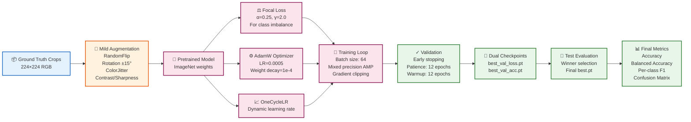
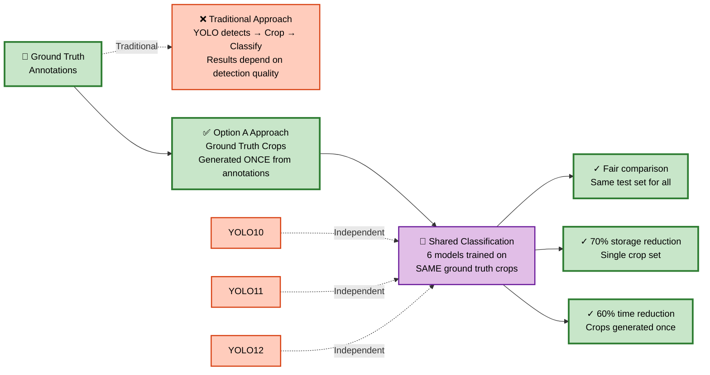
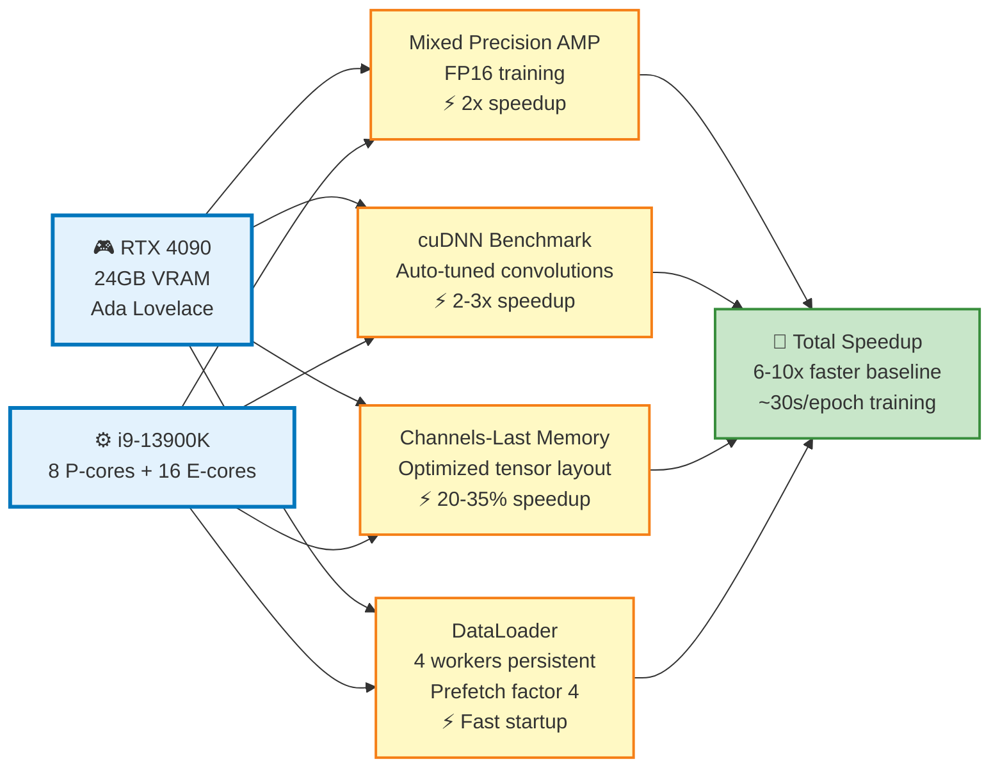

# Malaria Detection System - Complete Flowchart

## Main System Architecture (Option A: Shared Classification)

```mermaid
flowchart LR
    %% Styling
    classDef inputStyle fill:#e1f5ff,stroke:#01579b,stroke-width:3px,color:#000
    classDef processStyle fill:#fff9c4,stroke:#f57f17,stroke-width:2px,color:#000
    classDef modelStyle fill:#f3e5f5,stroke:#4a148c,stroke-width:2px,color:#000
    classDef outputStyle fill:#c8e6c9,stroke:#1b5e20,stroke-width:3px,color:#000
    classDef analysisStyle fill:#ffccbc,stroke:#bf360c,stroke-width:2px,color:#000

    %% Input Stage
    START([📁 Raw Datasets]):::inputStyle
    DS1[IML Lifecycle<br/>4 Stages]:::inputStyle
    DS2[MP-IDB Species<br/>4 Species]:::inputStyle
    DS3[MP-IDB Stages<br/>4 Stages]:::inputStyle

    %% Data Preparation
    PREP[📊 Data Preparation<br/>Train/Val/Test Split<br/>60%/24%/16%]:::processStyle

    %% Parallel Paths
    PATH_DET[🎯 Detection Pipeline]:::processStyle
    PATH_CLS[🔬 Classification Pipeline]:::processStyle

    %% Detection Models
    YOLO10[YOLOv10-Medium<br/>20M params]:::modelStyle
    YOLO11[YOLOv11-Medium<br/>20M params]:::modelStyle
    YOLO12[YOLOv12-Medium<br/>20M params]:::modelStyle

    DET_TRAIN[⚙️ Detection Training<br/>100 epochs<br/>Patience: 50-70]:::processStyle
    DET_EVAL[📈 Detection Metrics<br/>mAP@50, mAP@50-95<br/>Precision, Recall]:::analysisStyle

    %% Ground Truth Crops (KEY: Not from YOLO!)
    GT_CROP[✂️ Ground Truth Crops<br/>From Raw Annotations<br/>224×224 pixels]:::processStyle
    CROP_SPLIT[📦 Crop Organization<br/>Train: ~860 crops<br/>Val: ~345 crops<br/>Test: ~230 crops]:::processStyle

    %% Classification Models
    DENSE[DenseNet121<br/>8M params]:::modelStyle
    EFF_B0[EfficientNet-B0<br/>5M params]:::modelStyle
    EFF_B1[EfficientNet-B1<br/>7M params]:::modelStyle
    EFF_B2[EfficientNet-B2<br/>9M params]:::modelStyle
    RES50[ResNet50<br/>25M params]:::modelStyle
    RES101[ResNet101<br/>44M params]:::modelStyle

    CLS_TRAIN[⚙️ Classification Training<br/>Focal Loss α=0.25 γ=2.0<br/>75 epochs, Patience: 12<br/>AdamW optimizer]:::processStyle
    CLS_EVAL[📊 Classification Metrics<br/>Accuracy, Balanced Acc<br/>Precision, Recall, F1<br/>Per-class metrics]:::analysisStyle

    %% Analysis & Comparison
    ANALYSIS[🔍 Comprehensive Analysis]:::analysisStyle
    DET_COMP[Detection Comparison<br/>YOLO10 vs 11 vs 12]:::analysisStyle
    CLS_COMP[Classification Comparison<br/>6 Architectures]:::analysisStyle
    SUMMARY[📋 Option A Summary<br/>Cross-model comparison]:::analysisStyle

    %% Final Outputs
    RESULTS[📄 Results & Reports]:::outputStyle
    TABLES[📊 Tables<br/>Table 9: Classification<br/>Detection metrics]:::outputStyle
    FIGURES[📈 Figures<br/>Confusion matrices<br/>Training curves<br/>Performance plots]:::outputStyle
    PAPER[📝 Publication Outputs<br/>Journal-ready tables<br/>High-quality figures]:::outputStyle

    %% Flow Connections
    START --> DS1 & DS2 & DS3
    DS1 & DS2 & DS3 --> PREP

    PREP --> PATH_DET
    PREP --> PATH_CLS

    %% Detection Path
    PATH_DET --> YOLO10 & YOLO11 & YOLO12
    YOLO10 & YOLO11 & YOLO12 --> DET_TRAIN
    DET_TRAIN --> DET_EVAL

    %% Classification Path (KEY: From Ground Truth)
    PATH_CLS --> GT_CROP
    GT_CROP -.->|From raw annotations<br/>NOT from YOLO| CROP_SPLIT
    CROP_SPLIT --> DENSE & EFF_B0 & EFF_B1 & EFF_B2 & RES50 & RES101
    DENSE & EFF_B0 & EFF_B1 & EFF_B2 & RES50 & RES101 --> CLS_TRAIN
    CLS_TRAIN --> CLS_EVAL

    %% Analysis Phase
    DET_EVAL --> ANALYSIS
    CLS_EVAL --> ANALYSIS
    ANALYSIS --> DET_COMP & CLS_COMP & SUMMARY

    %% Final Outputs
    DET_COMP & CLS_COMP & SUMMARY --> RESULTS
    RESULTS --> TABLES & FIGURES & PAPER
```

## Detailed Classification Training Flow

## Key Innovation: Shared Classification Architecture

## GPU Optimization Stack

